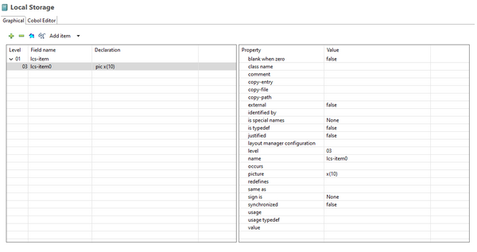

### Local Storage Designer

The Local Storage Designer defines data items for the program’s Local-Storage Section as well as including existing copybooks. The isCOBOL IDE will generate the COBOL code for the program’s Local-Storage Section.

It’s also possible to write Local-Storage code by hand, after switching to the *Cobol Editor* page. The code you type here will be generated at the bottom of the Local-Storage Section of the program.

