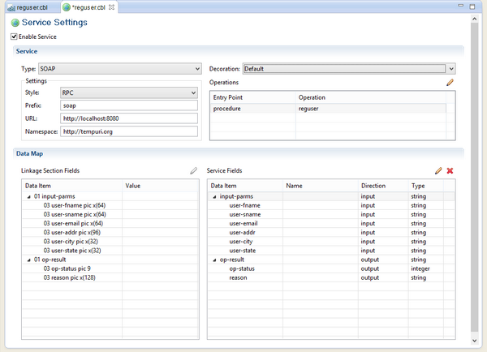

### isCOBOL Service Editor

The isCOBOL Service Editor activates and configures the Service Bridge facility. When you open a source file with this editor, you’re allowed to map the Linkage Section parameters to Web Service parameters as well as choosing the Web Service type and characteristics. As soon as you save modifications, the original source code is updated with the proper compiler directives.

