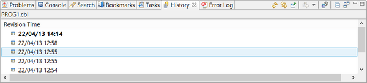

## History

The History view lists all the changes made to a text file. Each line corresponds to a saved copy of the file. From here it’s possible to compare two different copies of the same file to see what’s different and also to restore a previously saved copy.

To populate the History view, right click in the Code Editor and choose *Team / Show Local History* from the popup menu.

To manage history entries, right click on their row in the view and choose the proper option from the popup menu.
