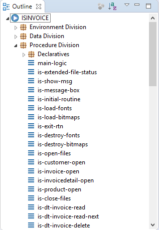
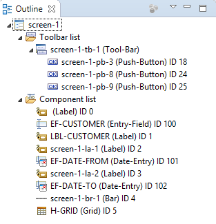

## Outline

The Outline view displays an outline of a structured file that is currently open in the editor area, and lists structural elements.

### Code Editor’s Outline

When the focus is in the Code Editor, the Outline view provides the list of sections and paragraphs of the current program. By clicking on the section or paragraph name, the corresponding line in the editor is highlighted.

### Screen / Report Designer’s Outline

While editing a Screen or a Report, the Outline view provides the list of controls. Name, type and ID are shown for each control. Clicking on a control selects it in the Designer.
