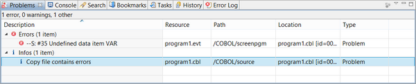
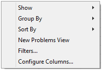
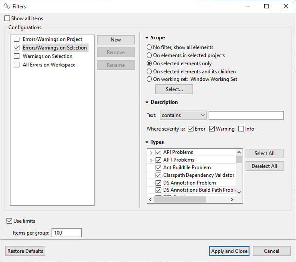

## Problems

The Problems view lists compiler errors and warnings.

The content of the Problems view and its layout can be configured via the pull-down menu:

- *Show* allows you to filter the types of errors that must be shown. By default all types of errors are shown.
- *Filters*... pops up a dialog in which you can set advanced filters.
- *Configure Columns*... allows you to configure the order and the width of the columns.

### Suggested Configuration

For a clear and precise output in the *Problems* view, Veryant recommends the following configuration, that you can set in the *Filters* dialog:

- "Show all items" should be unchecked
- only "Errors/Warnings on Selection" should be checked in the list
- *Scope* should be set to "On selected elements only"

Also, it’s best practice to sort problems by Location rather than by Description. You can set this preference by selecting *Sort By* in the pull-down menu.
