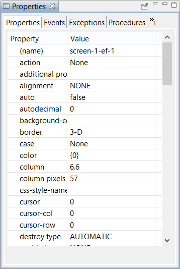

## Properties

The Properties view shows the list of properties and styles that can be set for the current control selected on the Screen Designer.

The Properties view also allows you to define Embedded and Event procedures for the control.

