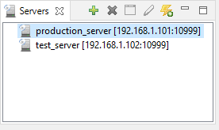

## Servers

The Servers view lists the available servers for remote projects handling.

For more details see [Working with Remote Projects](../Working-With-Remote-Projects/Working-With-Remote-Projects).

To add a new server, click the *New Remote Server* button and provide the requested information: name, IP address and port number.

To remove a server, select it and click the *Remove Remote Server* button, then confirm when prompted.

To show compiler and runtime settings set in a server, select the server and click the *Show Properties* button.

To edit compiler and runtime settings set in a server, select the server and click the *Modify Properties* button. Depending on the setting of [iscobol.as.authentication \*](../../is-cobol-evolve/SDK-Users-Guide/Compiler-and-Runtime/Configuration/Configuration-Properties#iscobol-server-thin-client-configuration) in the server configuration, you might be prompted for administrator credentials for this action. The following sections are available:

| | |
| --- | --- |
| Compiler | Compiler options. |
| Runtime | Runtime options. |
| Classpath | List of folders and libraries that are added to the Classpath during the compilation and the execution of the programs. Note that you can select only items that are under the isCOBOL Server’s working directory. |
| | |

To try connecting again to a server whose connection is broken, select the server and click the *Reconnect* button.

All these actions are also available in the context menu that appears by right clicking in the Servers view.
