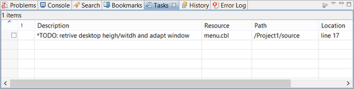
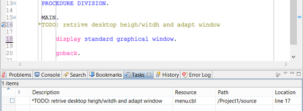

## Tasks

The Tasks view displays all Tasks set in the current Workspace.

To create a new Task, right click on the vertical gray bar at the left of the Code Editor and choose *Add Task*... from the popup menu.

A new Task is automatically created for each commented line that includes the keywords *TODO* or *FIXME*.

To reach the source line associated to the Task, double click on the Task row in the Tasks view.
