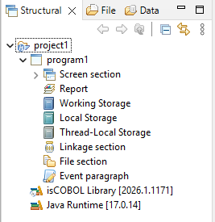
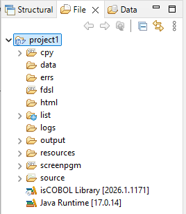
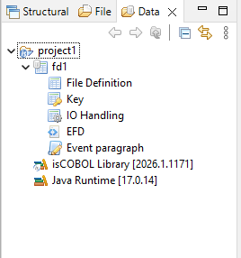
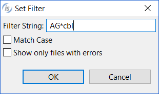

## isCOBOL Explorer

The isCOBOL Explorer view lists all the projects of the current workspace and allows you to manage their resources. By default this view is placed on the left side of the IDE window.

The isCOBOL Explorer consists of three pages:

### Structural

The *Structural* page lists the Screen Programs available in the project.

### File

The *File* page lists the physical disc files of the project.

### Data

The *Data* page lists the Data Layouts available in the project.

### Filtering content

It’s possible to set a filter for the programs list in the *Structural* view, the fd list in the *Data* view and for the folders in the *File* view.

In order to set or edit a filter

1. select the resource in the view
2. right click and choose *Set Filter* from the pop-up menu
3. fill the dialog with the desired pattern. For example, in order to filter all source files whose name begins with "AG", set

When the container is filtered, a decoration is added to its icon in the view.

To remove a filter

1. select the resource in the view
2. right click and choose *Remove Filter* from the pop-up menu

To remove all filters in the workspace

1. select the resource in the view
2. right click and choose *Remove All Filters* from the pop-up menu
