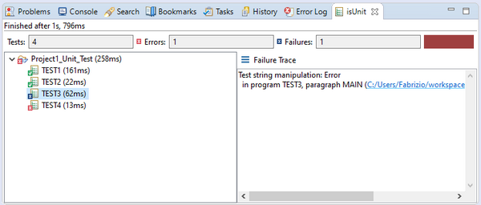

## isUnit

The isUnit view shows the result of a Unit Test. See [Running an Unit Test from the IDE](../../is-cobol-evolve/SDK-Users-Guide/Advanced-Features/isCOBOL-Code-Coverage/Running-an-application-with-isCOBOL-Code-Coverage-from-the-IDECoverage-Report) for more information.

