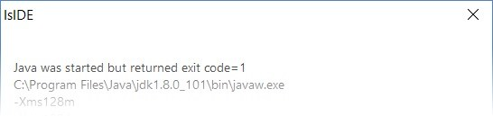

# Troubleshooting

In this chapter you find a list of the most common issues that you could encounter using the IDE.

## Startup issues

The IDE may fail to start with an error message like this:

This kind of error is caused by invalid Java options. Review the file isIDE.ini in the IDE installation folder and ensure that all the Java options are valid and accurate. In particular, double check the memory limits imposed by the Xms and Xmx options and ensure that they’re suitable for your system.

## General issues during the work

For most of the issues that you could encounter while working on a project with the IDE, check the [Error Log](./The-isCOBOL-IDE-Perspective/Error-Log) view. This view includes the list of exceptions generated by your actions. The error messages of these exceptions may help understanding what has gone wrong.

## Performance issues

If you’re working on huge projects you may consider disabling the Build Automatically feature in order to avoid unwanted builds as soon as you save a modification. Building huge projects may take several seconds.

If you think that the build of a project is taking too much time, double check the source files location. Generally speaking, a project whose source files and copybooks are linked resources and reside on a network drive is less optimized than a project whose source files and copybooks are included in the project folders on the local drive. If you need to share the project files with other developers, a source control solution like [SVN](https://subversion.apache.org/) or [Git](https://git-scm.com/) is preferable to storing the files on a network drive.

If the Code Editor slows down while you’re writing code, consider disabling folding and reconciling in [Preferences: isCOBOL -> Editor](./Configuration/Customization/Setting-Editor-preferences).

## Workspace compatibility issues

It can happen that using the latest IDE to open a workspace created by an older IDE generates errors. These errors are shown in the [Error Log](./The-isCOBOL-IDE-Perspective/Error-Log) view. In these cases it’s good practice to create a brand new workspace using the latest IDE and then import the projects from the old workspace into the new one as described in [Adding an existing Project to the current Workspace](./Working-With-Projects/Adding-an-existing-project-to-the-current-Workspace).

## Perspective layout issues

It can happen that you accidentally close a view or move it to an unwanted location by dragging the mouse over the IDE window. In this case you can restore the initial layout as follows:

1. click on *Window* in the menu bar
2. choose *Perspective > Reset Perspective*...
