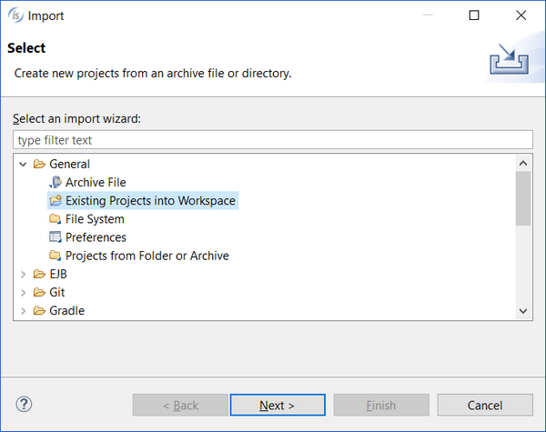

## Adding an existing Project to the current Workspace

isCOBOL IDE can also import an existing project that is part of another workspace into the current workspace. To import another project, right click in the [isCOBOL Explorer](../The-isCOBOL-IDE-Perspective/isCOBOL-Explorer) area and choose *Import* from the pop-up menu. Then select *General / Existing Projects into Workspace* from the tree.

A wizard procedure will ask for the location of the source workspace (the directory containing a folder named .metadata). Once the workspace is found, all of its projects are listed and you can choose the ones you wish to import.
