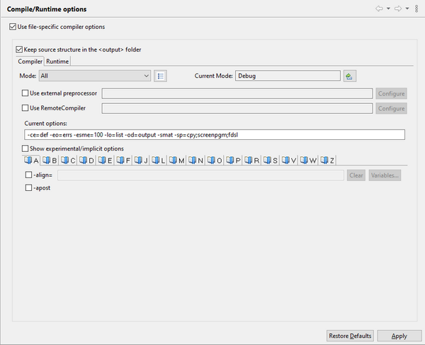
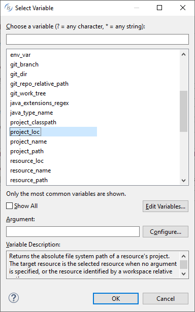
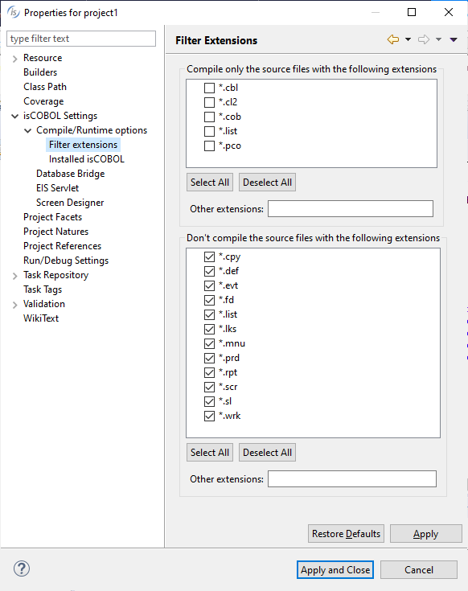

## Compiling

In order to compile programs correctly it is necessary to set the proper compiler options. If this was not done during project creation, it can be done now by clicking on *Project* menu and choosing *Properties*, then *isCOBOL Settings* and *Compile/Runtime options*. Compiler options are distributed in multiple pages of a tab-control. Find and check the ones you need.



**Note** - some options are prefixed by “#” instead of “-”. It means that the option is enabled by default in the compiler. Activating the check-box will cause the option to be removed from the default compiler options.

**Note** - the -jo option in the IDE can be used also to pass Java properties, as long as they’re prefixed with -J, i.e.

The same can’t be done on the Compiler command line, where properties must be passed without the -jo option, i.e.

```cobol
iscc -J-Xmx4g -J-Xss1m ...
```

In this options panel, it is possible to define different sets of options. By default, the "Debug" set is active. You can define options that should be used when compiling for "Debug", for "Release" or for both of them. In this panel you also choose the active set of options that will be used the next time you compile a program.

Placing the mouse cursor over the name of a compiler option will show a pop-up hint with a short description of its effect. To retrieve additional information on compiler options and their effects, please consult [Compiler Options](../../is-cobol-evolve/SDK-Users-Guide/Compiler-and-Runtime/Compiler/Compiler-Options).

Some options are followed by a value. It is possible to use variables inside the value. Variables are referenced with the syntax ${<Variable-Name\>}. Click the "Variables..." button to access the list of available variables. The dialog that opens allows you to select an existing variable as well as edit, remove or add variables. 

Variables are bound to the current workspace and shared among all the projects in the workspace.

When specifying -sp value, if you need to add a folder that is part of another project in the same workspace, you have to use the special syntax ${<Project-Name\>}/folder (where <Project-Name\> is the name of the other project). For your convenience, a Browse button is provided after the -sp field. Use the browse function to explore workspace folders and disk folders, select the desired copybook folder and have the correct value in the -sp field. Note that, if a variable named "${<Project-Name\>}" exists, then the value of the variable is used instead of the project name.

If the option *Keep source structure in the <output\> folder* is active (default), the IDE replicates the sub folders of the project source folder (if any) in the project output folder.

If *Use file-specific compiler options* is checked, then you can specify different compiler options for every single file in the project source directory, otherwise every file inherits settings from this page. To specify custom options for a specific file, right click on the source file name in the File view of the [isCOBOL Explorer](../The-isCOBOL-IDE-Perspective/isCOBOL-Explorer) and choose *Properties* from the popup menu. Then choose *settings* from the tree.

It’s also possible to filter the file types that the IDE will try to compile. By default, there is no filter, so every file placed in the *source* folder is subjected to compilation.



The isCOBOL IDE automatically compiles the programs as soon as source files are added to a project or are saved to disk after editing. This keeps the entire project built at all times. This feature can be disabled by clicking on *Project* menu and unchecking *Build Automatically*.

To manually compile a program, click on the following button:

Alternatively, use the keyboard shortcut:

```cobol
Ctrl+AltF9
```

The program compilation is performed in two steps:

1. compile COBOL to java
2. compile java to class

Errors produced by the first step are traced in the [Problems](../The-isCOBOL-IDE-Perspective/Problems.md) view.

Errors produced by the second step are traced in the [Error Log](../The-isCOBOL-IDE-Perspective/Error-Log) view.

Before compiling, it’s possible to switch the current mode, choosing between “Debug”, “Release” or a custom mode, if any. To switch the current mode for the current project, click on *Project* in the menu bar and choose *Change Current Mode*. To switch the current mode for all the projects in the workspace, click on *Project* in the menu bar and choose *Change Current Mode for All Projects*.

### Reloading isCOBOL’s copybooks

When you upgrade the IDE or change the isCOBOL Library associated to your project, the isCOBOL copybooks in the *cpy* folder are left unchanged. In order to use new features added in the upgrade, you must manually reload the copybooks. Right click on the *cpy* folder and choose *Reload isCOBOL’s copybooks* from the pop-up menu. isCOBOL’s standard copybooks (like “isgui.def”) are re-loaded from the *isdef* folder of the linked isCOBOL Library, while IDE’s exclusive copybooks (like “isreport.def”) are re-loaded from the *dropins* folder of the IDE.

### Verifying the compiled class

The compiled class is stored under the *output* directory of the project unless differently configured in *Compile/Runtime options*.

After you find the program class in the [isCOBOL Explorer](../The-isCOBOL-IDE-Perspective/isCOBOL-Explorer), under the *File* tree, you can right click on it and choose "Class Info" from the context menu.

The IDE will print useful information about the class in the [Console](../The-isCOBOL-IDE-Perspective/Console) view.
