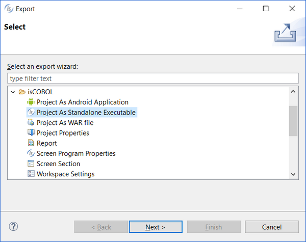
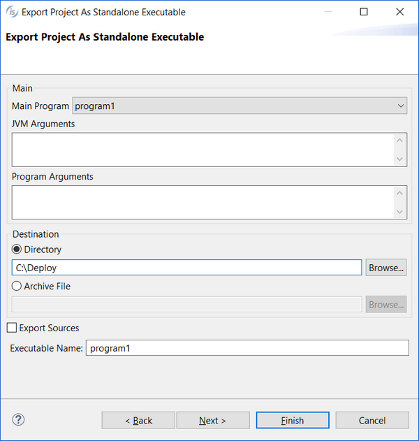

### Deployment facility (JAR)

isCOBOL IDE allows you to build a stand-alone package of your project in order to facilitate the deployment.

This is useful to deploy desktop applications.

1. Right click on project name in the [isCOBOL Explorer](../The-isCOBOL-IDE-Perspective/isCOBOL-Explorer) area.
2. Choose *Export* from the pop-up menu.
3. Choose *isCOBOL / Project As Standalone Executable* from the tree.

4. Click *Next*.
5. Select the desired project from the list.
6. Click *Next*.
7. Fill the fields with the required information.

- *Main Program* - select the main program from the ones in the project.
- *JVM Arguments* - optionally specify arguments for the JVM (e.g. -Xmx option).
- *Program Arguments* - optionally specify command-line parameters for the COBOL program.
- *Destination* - store resulting files in a folder or in a tar archive.
- *Export Sources* - optionally include source files in the package.
- *Executable Name* - name of the jar that will allow you to start the COBOL application (the jar extension is automatically applied, do not specify it).

8. If the project needs external jar files, click *Next* and choose to export them as well before clicking *Finish*. Otherwise click *Finish*.

The package is generated in the folder (or in the archive) specified by *Destination* (see point 7). The package consists of the following folder structure:

- *output* - contains COBOL program class files.
- *resources* - contains the configuration file and other resources for the project.
- *libs* - contains necessary jar libraries such as the isCOBOL runtime and third party libraries (see point 8).
- *source* - contains the source files (only if you checked Export Sources in point 7).
- *bin* - contains the main jar that allows you to start the COBOL application (see *Executable Name* in point 7).

If jar files are associated with the JVM in the system, then you can start the application by double clicking on *Executable Name*.jar. Otherwise, change to that directory and run the command: java -jar *Executable Name*.jar.
