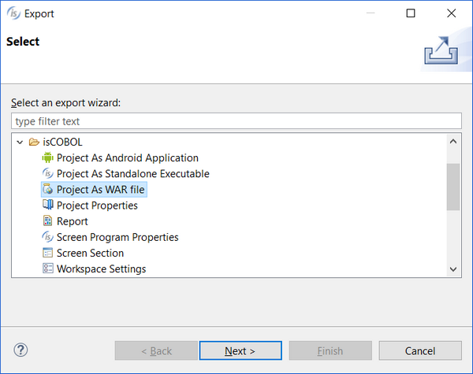
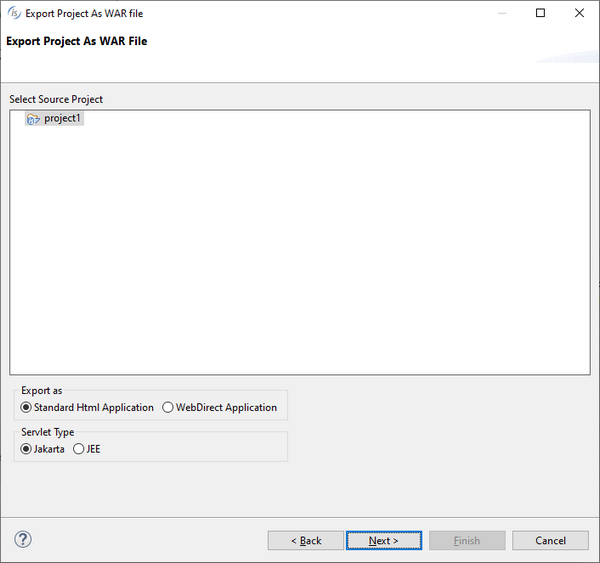
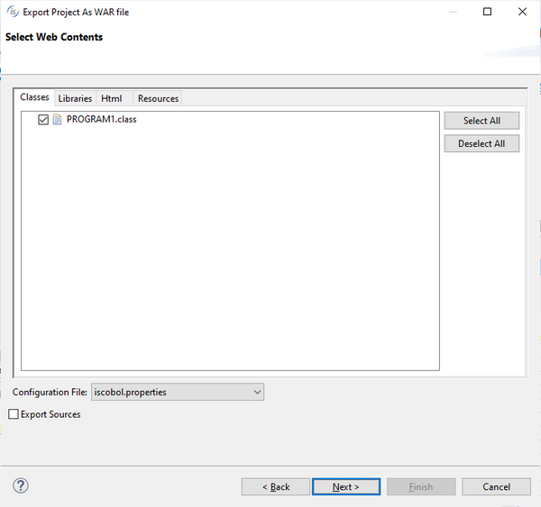
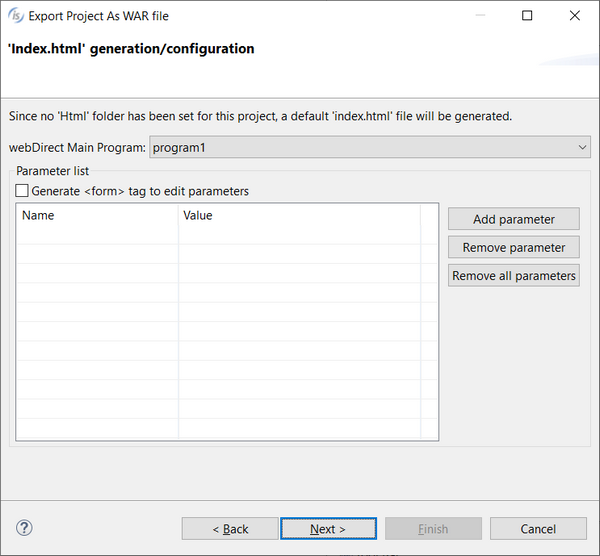
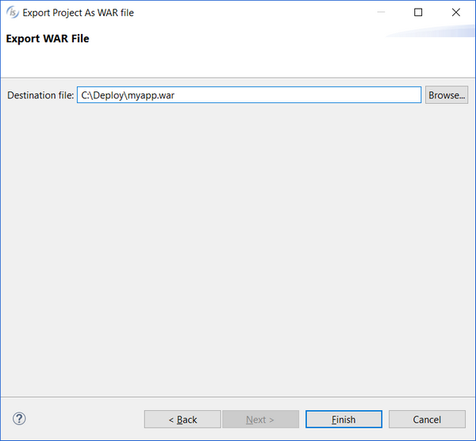

### Deployment facility (WAR)

isCOBOL IDE allows you to build a WAR library of your project in order to facilitate the deployment.

This is useful to deploy web applications, either standard HTML applications or WebDirect applications.

1. Right click on project name in the [isCOBOL Explorer](../The-isCOBOL-IDE-Perspective/isCOBOL-Explorer) area.
2. Choose *Export* from the pop-up menu.
3. Choose *isCOBOL / Project As WAR File* from the tree.

4. Click *Next*.
5. Select the desired project from the list and choose between *Export as Standard Html Application or Export as WebDirect Application*.
6. Set *Servlet Type* to "Jakarta" to obtain a WAR that is suitable for Jakarta servlet containers like Tomcat 10. Set *Servlet Type* to "JEE" to obtain a WAR that is suitable for JEE servlet containers like Tomcat 8 and Tomcat 9.
7. Click *Next*.
8. In the next page you’re asked to choose which programs and which external libraries from the project Classpath should be included in the WAR. Among external libraries custom libraries in the project Classpath are automatically checked, but only the essential runtime items are checked; if you need more runtime libraries for specific features (e.g. the openpdf library to print PDFs), then you have to check them before proceeding.

If you’re exporting as “standard Html Application”, then you’re also asked to choose which HTML, JS and CSS files should be included in the WAR.

If your project included the *resources/cs*s folder, you will find this folder listed under the Resources tab when you’re exporting as “standard Html Application”, but not when you’re exporting as “WebDirect Application”. In the former case the css folder is copied to the *WEB-INF/classes* of the WAR, if checked; in the latter case instead it’s always copied to the *resources* folder of the WAR.

9. Click *Next*

If you’re exporting as “WebDirect Application” and the project doesn’t include the *html* folder, then the following additional screen appears:

You have to tell which is the main program of your web application and you can make the IDE generate an HTML form that the user can use in order to set chaining parameters received by the main program. Click *Next* when you have provided the necessary information.

If the folder *html* is present in your project instead, then the content of that folder is included in the root folder of the war.

10. Choose the name and path of the WAR and click *Finish*.

The resulting WAR file is ready to be deployed in Tomcat or another servlet container.
