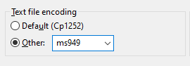
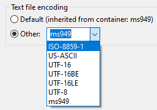

## Editing and compiling source files with a different encoding

Source files and copybooks may have been encoded with a specific character set that doesn’t match the current character set in the IDE. This situation leads to a wrong display of the text in the code editor and compiler errors.

To obtain a correct display of the text in the code editor and a correct compilation you can configure the IDE to use the proper encoding. The encoding can be configured at different levels:

- at workspace level, to affect all the projects in the workspace,
- at project level, to affect all the programs in the project,
- at program level, to affect all the source files of a program,
- at source file level, to affect only a specific source file.

To configure the encoding at workspace level:

1. click on *Window* in the menu bar and choose *Preferences*,
2. expand *General* in the tree on the left and select *Workspace*,
3. alter the *Text File Encoding* setting by choosing "Other" and providing the correct value. If the desired encoding doesn’t appear in the list, you can type the encoding name into the field.

Example

To configure the encoding at project or file level:

1. right click on the resource (project name, source name or copybook name) in the isCOBOL Explorer
2. choose *Properties*
3. select *Resource* from the list on the left
4. alter the *Text File Encoding* setting by choosing "Other" and providing the correct value. If the desired encoding doesn’t appear in the list, you can type the encoding name into the field.

Example

The text file encoding set at program level, that can be specific for the program or inherited from the workspace, is used while compiling the program in the IDE.

The text file encoding set at project level, that can be specific for the project or inherited from the workspace, is used while running the program from the IDE.
