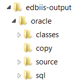

### Generating DatabaseBridge subroutines using the IDE integration

isCOBOL IDE can automatically generate EDBI subroutines when the project is built. If this feature was not activated during project creation, it can be done now by clicking on *Project* menu and choosing *Properties*, then *isCOBOL Settings* and *DatabaseBridge*.

Check the option *Launch EDBIIS during build* to activate the feature.

Also check the proper options depending on the database you want to interface.

EDBIIS can be launched also manually at any time by clicking on Project menu and selecting *Launch Edbiis*.

**Note**: since EDBIIS process EFD dictionaries in order to produce subroutines, ensure that *-efd *compiler option is set for the project. See [Compiling](../Compiling) for details on how to set compiler options.

If the subroutine generation is successful, a new subfolder appears in the project tree.

*edbiis-output* contains a folder for each database you checked in the preferences (in the above picture, Oracle is shown). The database folder contains four folders:

- *classes*: compiled classes of subroutines
- *copy*: subroutine copyfiles
- *source*: subroutine source code
- *sql*: table schema generated by EDBIIS (documentary only)

If the subroutine generation fails, check the Error Log view for errors in the EDBIIS setup and the Console view for errors in the EDBIIS activity.
