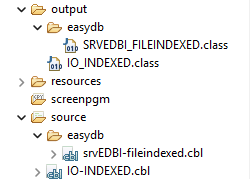

### Generating DatabaseBridge subroutines using the Compiler integration

You can instruct the Compiler invoked by the isCOBOL IDE to generate DatabaseBridge subroutines by adding one or more entries to the *resources/iscobol.properties* file of the project. For example, to generate subroutines for the Microsoft SQL Server database, add these lines:

```cobol
iscobol.compiler.easydb=true
iscobol.compiler.easydb.sqlserver=true
```

Enabling subroutines generation in the *resources/iscobol.properties* file affects all the programs in the project. If you wish to generate subroutines only for one or few specific programs, don’t edit the *resources/iscobol.properties* file, but add the corresponding compiler directives at the top of the programs source code. For example, to generate subroutines for the Microsoft SQL Server database, change the program’s first lines as follows:

```cobol
      $set "easydb" "true"
      $set "easydb.sqlserver" "true"
 
       IDENTIFICATION DIVISION.
       PROGRAM-ID. io-indexed.
```

When the program is compiled, by default, two subdirectories named *easydb* are generated under the *source* directory and the *output* directory of the project, and they contain the DatabaseBridge subroutines source code and compiled classes respectively.



To change the location of the subroutines source files, use the [iscobol.compiler.easydb.output](../../../is-cobol-evolve/SDK-Users-Guide/Compiler-and-Runtime/Configuration/Configuration-Properties#compiler-configuration) Compiler setting.

**Note** - Relative paths in the DatabaseBridge configuration (i.e. [iscobol.compiler.easydb.output](../../../is-cobol-evolve/SDK-Users-Guide/Compiler-and-Runtime/Configuration/Configuration-Properties#compiler-configuration) and [iscobol.compiler.easydb.sql.output](../../../is-cobol-evolve/SDK-Users-Guide/Compiler-and-Runtime/Configuration/Configuration-Properties#compiler-configuration)) are resolved from the project’s *source* directory.
