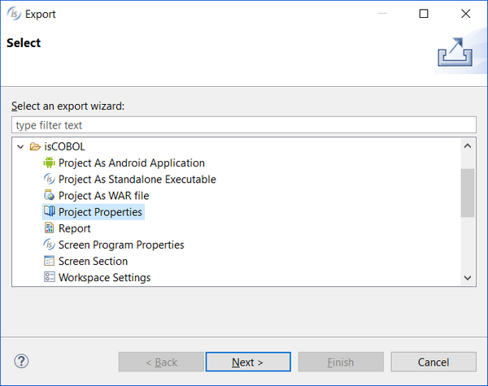
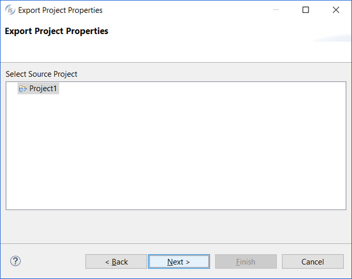

## Import / Export Project Properties

isCOBOL IDE exports the current project settings to share them with other projects.

To export project settings:

1. Right click on project name in the [isCOBOL Explorer](../The-isCOBOL-IDE-Perspective/isCOBOL-Explorer) area.
2. Choose *Export* from the pop-up menu.
3. Choose *isCOBOL / Project Properties* from the tree.

The next panel will prompt for a file name. You can choose any name and extension. The IDE produces an xml output.

To import project options, the steps are very similar:

1. Choose *Import* from the pop-up menu.
2. Choose *isCOBOL / Project Properties* from the tree.
3. Choose the disk file containing the project settings. The file must have been created with the export procedure described above.
