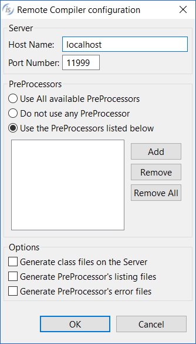

## Remote Compiling

isCOBOL IDE allows you to compile programs remotely. Assuming that there is a RemoteCompiler listening on a server, you can instruct the IDE to delegate the compilation to it.

To activate this feature

1. click on *Project* menu
2. choose *Properties*
3. expand *isCOBOL Settings* and select *Compile/Runtime* options
4. check the *Use RemoteCompiler* option
5. click on the *Configure* button and input the necessary information

*Host Name* and *Port* are the address and the port of the server where the RemoteCompiler is listening. PreProcessors Names is the list of preprocessors that must be invoked to precompile the source file (click on the *Add* button to add items to the list). Remaining settings are optional.

Now, each time you issue a compilation, it will be done remotely. To disable the feature and compile locally, uncheck the *Use RemoteCompiler* option.
