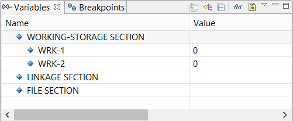
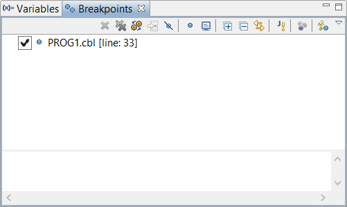

### Debug Perspective

A better interface for the debug process is offered by the Debug Perspective. To switch to the Debug Perspective:

- click on the *Window* menu
- choose *Open Perspective*
- choose *Debug*

The Debug Perspective contains two views that allow you to manage Variables and Breakpoints.

The Variables view allows the user to monitor the content of variables.

The Breakpoints view allows the user to toggle breakpoints and monitors.

When the debugging session terminates, the IDE switches back to the isCOBOL perspective.

Debugger commands are available under the Run menu in the menu bar. Some of them are available among tool-bar buttons as well. The following table lists the available commands:

| Command | Tool-Bar Button | Meaning |
| --- | --- | --- |
| Command | Tool-Bar Button | Meaning |
| Resume | x | Run until a breakpoint, a monitor or the end of the runtime session is reached |
| Suspend | x | Suspend the debugger |
| Terminate | x | Terminate the current runtime session |
| Disconnect | x | Disconnect from the runtime session (remote debug only) |
| Step Into | x | Execute the current statement |
| Step Over | x | Run to the next statement |
| Step Return | x | Run to the end of paragraph |
| Step Out Program | x | Run until program terminates and you return to the caller program |
| Run to Line |  | Run to the selected line |
| Jump to selected line |  | Run to the selected line skipping all the statements in the middle |
| Toggle Breakpoint |  | Add a breakpoint to the selected line |
| Skip All Breakpoints |  | Enable/Disable active breakpoints |
| Display Variables on Line |  | Shows the content of variables in the current line with a graphical message box |
| Display Class Info |  | Shows class information with a graphical message box |
