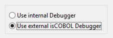

### External Debugger

By default, when you debug a program, the IDE switches to the Debug perspective. If you prefer to use the standard isCOBOL Debugger, started outside of the IDE, you can configure it as follows:

1. click on *Window* in the IDE menu bar
2. choose *Preferences*
3. expand the *isCOBOL* tree
4. choose *Run/Debug*
5. switch from “Use internal Debugger” to “Use external isCOBOL Debugger”
6. click *OK*

For more information about isCOBOL Debugger, please consult [Debugger](../../../is-cobol-evolve/SDK-Users-Guide/Debugger/Overview).
