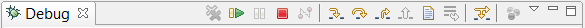

## Run and Debug

In order to run or debug a program from inside the IDE, highlight the main source file name in the [isCOBOL Explorer](../../The-isCOBOL-IDE-Perspective/isCOBOL-Explorer) or click on the editor window for the main program file, and click on the Run menu and choose *Run As -> isCOBOL Application or Debug As -> isCOBOL Application*.

Program arguments, configuration and working directory are defined in the runtime mode. The current runtime mode is displayed in the IDE status-bar. You can change the current mode or configure new modes in project properties, under [Compile and Runtime options](../../Working-With-Projects/Setting-Project-properties/Compile-and-Runtime-options).

Run and Debug features can also be reached through the proper buttons on the IDE toolbar:

The following keyboard shortcuts are also available:

| | |
| --- | --- |
| CTRL+F11 | Run As |
| F11 | Debug As |
| | |

**Note** - When the user runs or debugs a program, if there are some unsaved editors, a message box appears, asking if the user wants to save the editors before the launch. In addition, if the option Build (if required) before launching is checked in *Preferences: Run/Debug -> Launching*, a build of the project is performed.

While debugging the program, available debug options and commands are shown in the Debug View, just below the editor, and the current statement is highlighted in the Code Editor.

**Note**: when you create a Run or Debug configuration you can set the working directory for the runtime session. When you run the program without a configuration, the working directory is automatically set to the “output” folder of the project.
