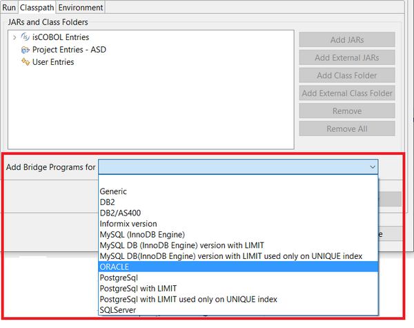

## Running with DatabaseBridge

If you plan to run your programs having DatabaseBridge as file index, then additional work is required.

1. Ensure that EDBI subroutines have been generated in your project (see [Generating DatabaseBridge subroutines](./Generating-DatabaseBridge-subroutines/Generating-DatabaseBridge-subroutines) for details).
2. Add the JDBC driver library provided by your database vendor to the project Classpath. Click on *Project* menu, select *Properties*, select *Class Path* from the tree. Click either the *Add JARs* button or the *Add External JARs* button, depending if the driver library is inside or outside your project, and browse for the driver library jar file.
3. Set [iscobol.file.index](../../is-cobol-evolve/SDK-Users-Guide/Compiler-and-Runtime/Configuration/Configuration-Properties#file-handling-configuration) to "easydb" in the configuration. If you generated subroutines using the [Compiler integration](./Generating-DatabaseBridge-subroutines/Generating-DatabaseBridge-subroutines-using-the-Compiler-integration), set [iscobol.easydb.prefix](../../is-cobol-evolve/SDK-Users-Guide/Compiler-and-Runtime/Configuration/Configuration-Properties#databasebridge-easydb-configuration) to the proper prefix; for example, to use subroutines for Microsoft SQLServer, set *iscobol.easydb.prefix=srv*.
4. Set [iscobol.jdbc.driver](../../is-cobol-evolve/SDK-Users-Guide/Compiler-and-Runtime/Configuration/Configuration-Properties#databasebridge-and-jdbcesql-configuration), [iscobol.jdbc.url](../../is-cobol-evolve/SDK-Users-Guide/Compiler-and-Runtime/Configuration/Configuration-Properties#databasebridge-and-jdbcesql-configuration) and any other applicable JDBC setting for your database connection in the configuration.

**Note** - the above settings can be done anywhere in the configuration, it doesn’t matter if your program performs SET ENVIRONMENT before opening a file or if you prefer to edit the *resources/iscobol.properties* file.

5. The final step depends on how you generated the DatabaseBridge subroutines:

- if you generated the DatabaseBridge subroutines using the [IDE integration](./Generating-DatabaseBridge-subroutines/Generating-DatabaseBridge-subroutines-using-the-IDE-integration), edit the Run Configuration of your program and, in the *Classpath* page, bind the proper database routines set:
- if you generated the DatabaseBridge subroutines using the [Compiler integration](./Generating-DatabaseBridge-subroutines/Generating-DatabaseBridge-subroutines-using-the-Compiler-integration),

a. edit the Run Configuration of your program,

b. switch to the *Classpath* page,

c. select *User Entries*,

d. click the *Add Class Folder* button and select the *output/easydb* directory of your project.

6. You’re now able to run your program using DatabaseBridge.
