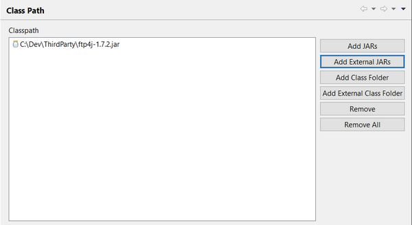

### Class Path

The *Class Path* panel allows you to add references to jar libraries or class folders to the project. This is important if you’re going to create programs that interact with Java objects.

Use *Add JARs* to browse for jar libraries located in the project’s folders.

Use *Add External JARs* to browse for jar libraries located outside the project’s folders.

Use *Add Class Folder* to browse for folders located in the project’s directory.

Use *Add External Class Folder* to browse for folders located outside the project’s directory.

Select an item and click *Remove* to remove it from the list.

Use *Remove All* to clean the list.
