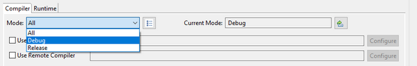
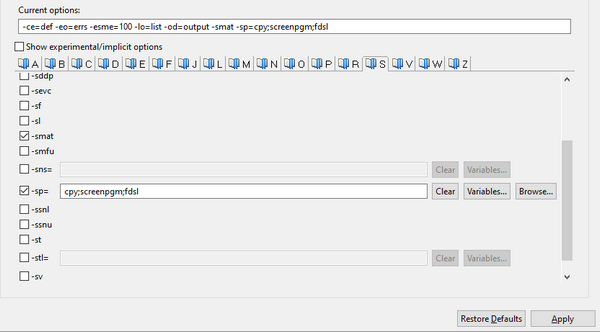
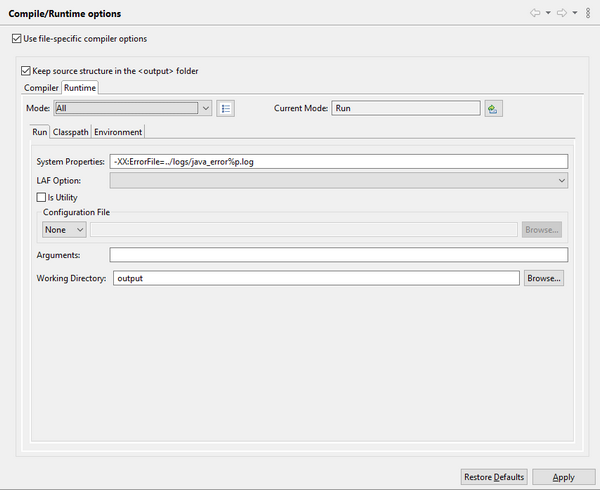
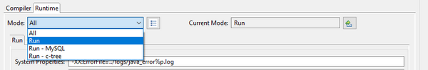

### Compile and Runtime options

*Compile and Runtime options* are found under the *isCOBOL Settings* item. Here you can specify compile options as well as runtime settings.

You can create different sets of options. Choose the set you wish to configure from the combo-box or click the button after the combo-box to create a new set.

You can switch the active mode by clicking on the *Change* button on the right in this panel, or by clicking on the Project menu and selecting *Change Current Mode*.

In the *Compiler* page, you can set compile options by checking them with the mouse. They’re distributed on different pages depending on their name. The list of options that are currently active appears in the text box just above these pages and can be edited from there also.

**Note** - the *-jj* and *-od* options set through [iscobol.compiler.options \*](../../../is-cobol-evolve/SDK-Users-Guide/Compiler-and-Runtime/Configuration/Configuration-Properties#compiler-configuration) in the compiler configuration are ignored by the IDE. Always use this panel to set the *-jj* and *-od* options.

See [Compiling](../Compiling) for more information about the setting of compiler options.

In the *Runtime* page, you can set command-line options and parameters.

You can create different sets of options. Choose the set you wish to configure from the combo-box or click the button after the combo-box to create a new set.

You can switch the active mode by clicking on the *Change* button on the right in this panel, or by clicking on the Project menu and selecting *Change Current Mode*.

There are three set of options under the Runtime configuration:

| | |
| --- | --- |
| Run | Here you can set Java options, like for example -Xmx to increase the heap memory.You can also choose the desired look and feel, provide a custom configuration file and arguments for the main program.You can also change the working directory for the runtime session. |
| Classpath | Here you can add additional items to the Classpath. These items will be appended to the ones that were listed in [Class Path](./Class-Path) and the resulting Classpath will be used for this specific runtime mode. |
| Environment | Here you can set environment variables for the current runtime mode and you can choose if these variables should be appended to the system environment or replace the system environment. |
| | |

**Note** - The runtime modes configured here will replace existing Run and Debug Configurations of the program at the next run.
