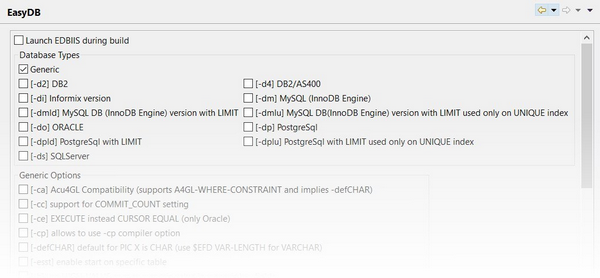

### Database Bridge

The *Database Bridge* is found under the *isCOBOL Settings* item and it allows you to set the options for the generation of DatabaseBridge subroutines.

See [Generating DatabaseBridge subroutines](../Generating-DatabaseBridge-subroutines/Generating-DatabaseBridge-subroutines) for more details.
