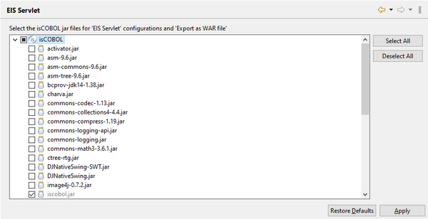

### EIS Servlet

The *EIS Servlet* is found under the *isCOBOL Settings* item and it allows you to define which isCOBOL SDK’s libraries must be used when running a project as EIS Servlet or when exporting a project to war file. By default, only iscobol.jar is selected.

