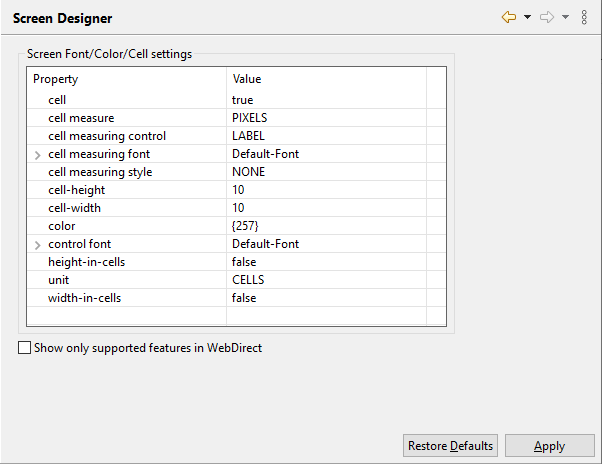

### Screen Designer

The *Screen Designer* is found under the *isCOBOL Settings* item and it allows you to set some defaults for the Screen Designer (see [Screen Programs](../../Screen-Programs/Screen-Programs) for more information on this tool).

When the "Show only supported features in WebDirect" option is checked, the properties that are not supported by WebDirect are not shown in the [Properties](../../The-isCOBOL-IDE-Perspective/Properties) view and the controls that are not supported by WebDirect are not shown in the *Component Palette*. This happens in the new screens that you create. If you open an existing screen that contains some components not supported by WebDirect, then these components are not modifiable, you can only delete them.

When you save these settings, the IDE asks if you want to apply the changes to the programs already created in the project. This behavior can be configured in the Preferences. See [Setting Screen Designer preferences](../../Configuration/Customization/Setting-Screen-Designer-Preferences/Setting-Screen-Designer-Preferences) for details.

These settings are applied to Screen Programs as well as Screens.
