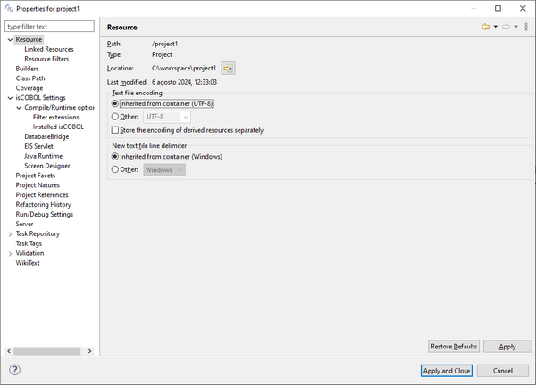

## Setting Project properties

Project settings affect all the programs of the project. In order to set them

- right click on the project name in the [isCOBOL Explorer](../../The-isCOBOL-IDE-Perspective/isCOBOL-Explorer)
- select *Properties* from the pop-up menu.

