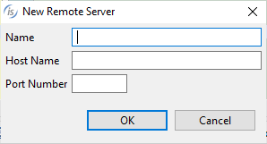
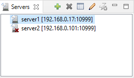

## Connecting the IDE to the isCOBOL Server

The isCOBOL IDE includes a [Servers](../The-isCOBOL-IDE-Perspective/Servers) view where available isCOBOL Servers can be defined.

Click the *New Remote server* button to define a new isCOBOL Server.

Fill the fields as follows:

| | |
| --- | --- |
| Name | A logical name to identify the server. You can write free text here. |
| Host Name | The host name or IP address where the isCOBOL Server is started and listening. |
| Port Number | The port where the isCOBOL Server is started and listening. |
| | |

After clicking OK, the IDE tries to connect to the isCOBOL Server, then it adds the server to the list. Depending on the connection result, the server might be listed as available or not available. The following screenshot depicts a situation where two servers were defined, but only the first one is available as the connection to the second one failed:

