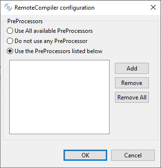

## Setting Compiler and Runtime options on the IDE Remote Server

When the isCOBOL Server is started from the first time, before an IDE connects to it, it includes the following default modes:

| Compiler | |
| --- | --- |
| Release | -smat option |
| Debug | -smat and -dx options |

| Runtime | |
| --- | --- |
| Run | No specific option or configuration |

After defining the isCOBOL Server in the IDE, you can edit its compiler and runtime configuration, by adding new modes or by modifying the existing ones. To do it, select the desired server in the [Servers](../The-isCOBOL-IDE-Perspective/Servers) view click the *Modify Properties* button. Unless [iscobol.as.authentication \*](../../is-cobol-evolve/SDK-Users-Guide/Compiler-and-Runtime/Configuration/Configuration-Properties#iscobol-server-thin-client-configuration) is set to 0 in the server configuration, you will be prompted for administrator credentials, that are user "admin" and password "admin" (lowercase) by default.

To review the current compiler and runtime modes available on the server, select the desired server in the [Servers](../The-isCOBOL-IDE-Perspective/Servers) view click the *Show Properties* button.

The good practice is to have a project manager that is responsible for setting compiler and runtime modes on the server and standard developers that use them without applying any change.

### Configuring the embedded Remote Compiler to use preprocessors

When the isCOBOL Server is started with the -ide option, it automatically activates a RemoteCompiler.

The RemoteCompiler configuration file is loaded by default from the user home directory. The default configuration file is: $USER_HOME/remoteCompiler.xml. Set the [iscobol.remotecompiler.conf](../../is-cobol-evolve/SDK-Users-Guide/Compiler-and-Runtime/Configuration/Configuration-Properties#remotecompiler-configuration) property to specify a different configuration file. The configuration files describes one or more preprocessors. Refer to [Server configuration](../../is-cobol-evolve/SDK-Users-Guide/RemoteCompiler/Server-Configuration) for information about the RemoteCompiler configuration file format and content.

You can instruct the isCOBOL Server to run one or more of the preprocessors that are configured in the RemoteCompiler configuration file. To do it, select the desired server in the [Servers](../The-isCOBOL-IDE-Perspective/Servers) view click the *Modify Properties* button. Click the Configure button after the RemoteCompiler field and the following dialog will appear:

Click the *Add* button and provide the *name* of the desired *preprocessor*. This name must match the name attribute of a preProcessor element in the RemoteCompiler configuration file.
