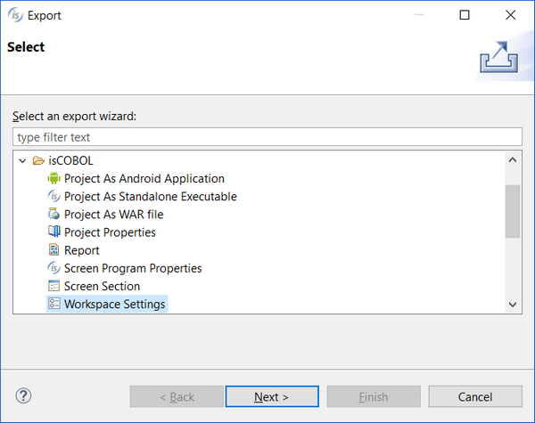
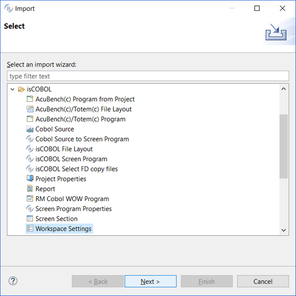

# Import / Export of Workspace settings

To export workspace preferences:

1. Click on the *File* menu
2. Choose *Export*
3. Expand *isCOBOL*
4. Choose *Workspace settings*

5. Click *Next*
6. Choose the destination file (it must have .prefs extension)
7. Click *Finish*

To import workspace preferences:

1. Click on the *File* menu
2. Choose *Import*
3. Expand *isCOBOL*
4. Choose *Workspace settings*

5. Click *Next*
6. Choose a saved settings file from disk (it must have .prefs extension)
7. Click *Finish*
