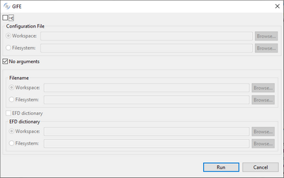
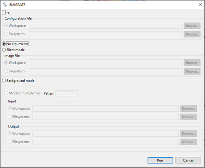
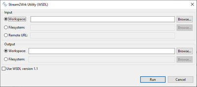
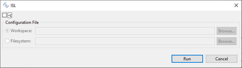
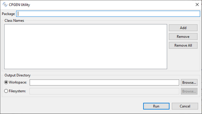
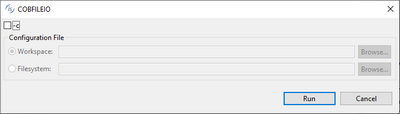
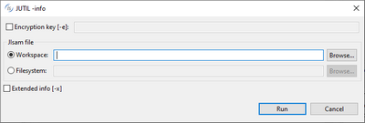

## Launching isCOBOL Utilities

1. Click on “isCOBOL Tools” in the menu bar.
2. Select “Utilities”.
3. Select one of the utilities to show a dialog that allows you to set the utility up and launch it:

| | |
| --- | --- |
| Index and Relative File Editor (GIFE) |  |
| Index File Migration (ISMIGRATE) |  |
| Create FD from RDBMS (JDBC2FD) |  |
| Color Picker (CPK) |  |
| Working Storage from Stream (STREAM2WRK) |  |
| isCOBOL Launcher (ISL) |  |
| JavaBean Copy Generator (CPGEN) |  |
| COBOL File IO Class generator (COBFILEIO) |  |
| Jisam File Utility (JUTIL) |  |
| | |

Graphical utilities (like CPK or ISL) appear over the IDE’s window.

Command line utilities (like STREAM2WRK or JUTIL) show their output in the [Console](../The-isCOBOL-IDE-Perspective/Console) view.
