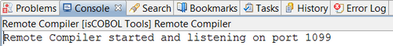
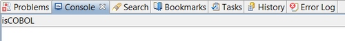

## Managing RemoteCompiler server

1. Click on “isCOBOL Tools” in the menu bar.
2. Select “RemoteCompiler”.
3. Select the desired action:

| | |
| --- | --- |
| *Start* | Start the RemoteCompiler; the output is shown in the Console View.  |
| *Stop* | Stop the RemoteCompiler; the Console View is cleaned.  |
| *Restart* | Stop and start the RemoteCompiler; the output is shown in the Console View.  |
| | |

The RemoteCompiler can be configured in the *Preferences* menu. See [RemoteCompiler Settings](../Configuration/Customization/Configuring-isCOBOL-tools#remotecompiler-settings) for more information.

**Note**: With this operation you start a RemoteCompiler server on the local machine. This is useful only for test purposes, since usually the RemoteCompiler server runs on a server machine with precompilers installed.
