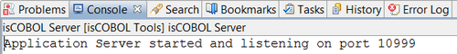
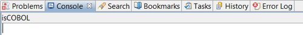

## Managing isCOBOL Server

1. Click on “isCOBOL Tools” in the menu bar.
2. Select “isCOBOL Server”.
3. Select the desired action:

| | |
| --- | --- |
| *Start* | Start the isCOBOL Server; the output is shown in the Console View.  |
| *Stop* | Stop the isCOBOL Server; the Console View is cleaned.  |
| *Restart* | Stop and start the isCOBOL Server; the output is shown in the Console View.  |
| | |

isCOBOL Server settings can be configured in the *Preferences* menu. See [isCOBOL Server Settings](../Configuration/Customization/Configuring-isCOBOL-tools#iscobol-server-settings) for more information.
