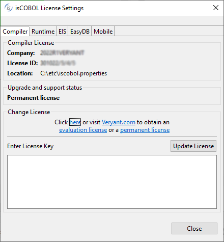

# License Management

You can review and update installed licenses in isCOBOL's IDE.

In order to check the current status of the installed licenses:

1. click on *Help* in the menu bar

2. select *isCOBOL License Status*

The following dialog appears:

On the top you can select the version number. There’s a page for each embedded isCOBOL SDK that requires separate license keys.

Every product is described in a different page. Select the desired page to review the license for that product. The IDE summarizes the license details and shows the location of the property file from which the license was loaded.

You can also update a license in this screen. To do that:

1. type the new license code in the text area on the bottom of the dialog

2. click the *Update License* button

isCOBOL IDE stores the new license in a file named iscobol.properties under the user’s home directory. Note that no license check is performed during this process. The new license will be validated when the IDE is restarted.
