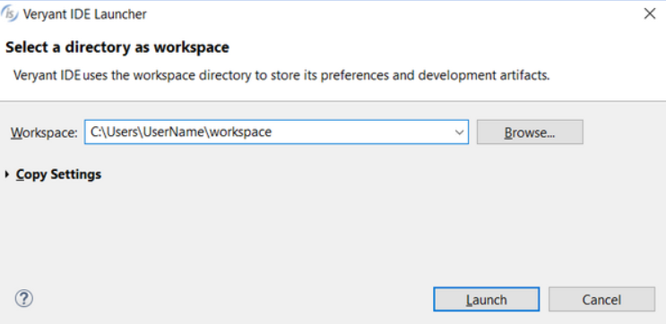
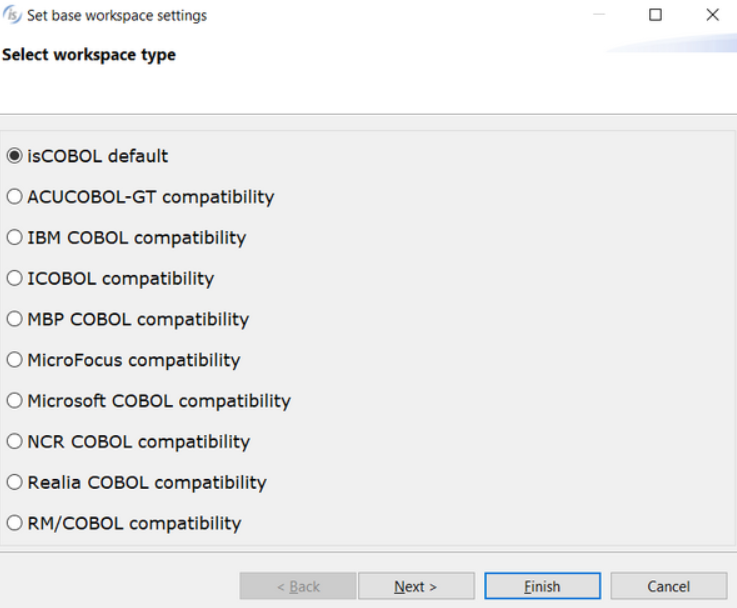

# Starting isCOBOL IDE and selecting the workspace

As soon as you start the isCOBOL IDE you’re prompted to select the workspace.

The workspace is a physical folder in which the projects created with the IDE are stored.

If you select an existing workspace, the IDE loads the projects of that workspace.

If you select an empty folder the IDE creates a new workspace. In this case, you’re asked if you wish to have a preset configuration for your projects.

If you’re going to maintain a COBOL application that was written with another COBOL, it’s good practice to choose the proper preset configuration. If you’re going to develop a brand new COBOL application, instead, choose "isCOBOL default".

In the next pages of the wizard you can configure the default options for the projects. This task can also be done later by clicking on *Window* in the menu bar of the IDE and choosing *Preferences*.

The [Compile and Runtime options]() may be overridden for each project and for each source file by right-clicking on the project/file in the ‘File’ view and selecting the Properties item in the pop-up menu.

The [Code Generation settings]() may be overridden for each screen program by right-clicking on the screen program in the ‘Structural’ view and selecting Properties in the pop-up menu.

See [Customization]() for details about the available configuration options.
