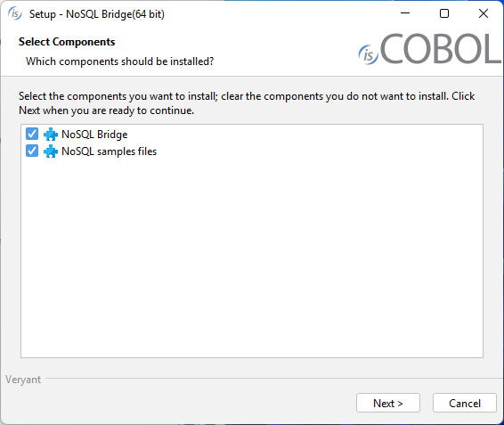
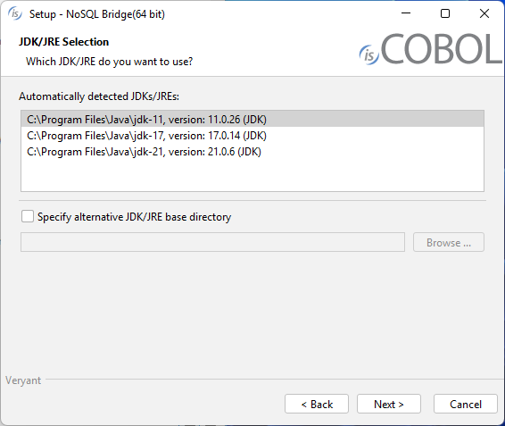

## Download and install NoSQL Bridge

### Windows

1. If you haven't already done so, [Download and install the Java Runtime Environment (JRE)](./Download-install-JRE).
2. Go to "[https://support.veryant.com](https://support.veryant.com)".
3. Sign in with your User ID and Password.
4. Click on the "Download Current Release" link.
5. Scroll down to the list of files for Windows x64 64-bit. Select isCOBOL_NoSQL_2026_R1_*n*_Windows.64.msi, where *n* is the build number.
6. Run the downloaded installer to install the files.

**Note** - If your Windows has the option "Run as Administrator", you should run the setup with that option, otherwise the setting of environment variables might silently fail.

7. Select the desired items from the list of products when prompted.
8. Select your JDK/JRE when prompted.
9. Follow the wizard procedure to the end. In the process you will be asked to provide the installation path ("C:\Veryant" by default) and license keys. You can skip license activation and perform it later, as explained in [Activate the License](./Activate-License).

### Quiet mode

The NoSQL Bridge setup supports the msi quiet mode. Settings can be driven with a response file.

A response file is a text file with name-value pairs that represent installer variables.

A response file is generated automatically after an installation is finished. The generated response file is found in the .install4j directory of the NoSQL Bridge and is named response.varfile.

When an installer is executed, it checks whether a file with the same name and the .varfile extension can be found in the same directory and loads that file as the response file. For example, if an installer is named foo\_setup.msi on Windows, the response file next to it has to be named foo\_setup.varfile.

For more information about msi setups and their command line options, see [Microsoft Standard Installer Command-Line Options](https://learn.microsoft.com/en-us/windows/win32/msi/standard-installer-command-line-options).

### Linux

1. If you haven't already done so, [Download and install the Java Runtime Environment (JRE)](./Download-install-JRE).
2. Go to "[https://support.veryant.com](https://support.veryant.com)".
3. Sign in with your User ID and Password.
4. Click on the "Download Current Release" link.
5. Scroll down to the list of files for Linux x64 64-bit. Select isCOBOL_NoSQL_2026_R1_*n*_Linux.64.x86_64.tar.gz, where *n* is the build number.
6. Extract all contents of the archive. For example:

```cobol
gunzip isCOBOL_NoSQL_2026_R1_*_Linux.64.x86_64.tar.gz
tar -xvf isCOBOL_NoSQL_2026_R1_*_Linux.64.x86_64.tar
```

### Distribution Files

For information on a specific distribution file, please see the README file installed with the product.
