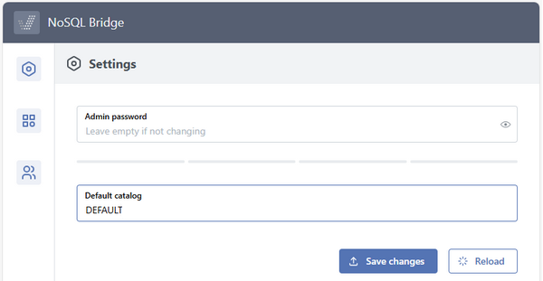

### Changing the ADMIN password and other settings

The Settings page allows you to change the admin password and the default catalog.

Fill the text fields with the new password and the new default catalog and click the *Save changes* button to confirm.
