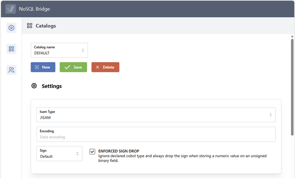
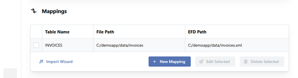
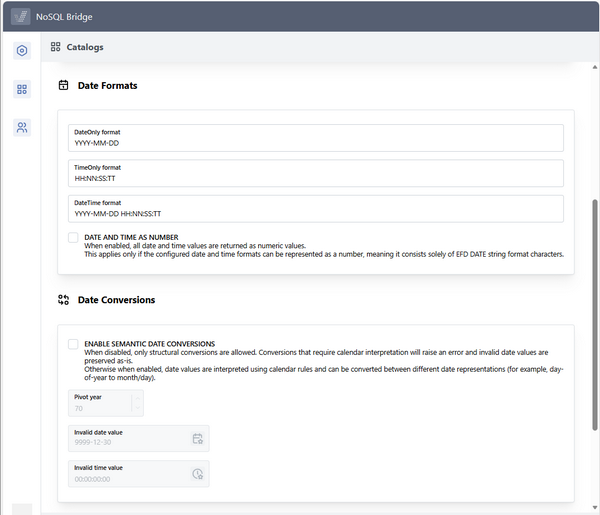

### Configuring Catalogs

The Catalogs page allows you to configure catalogs.

A catalog is a list of indexed files that you wish to expose through the NoSQL Bridge API functions.

For each file you have to provide a logical name that the API functions will use as reference, and you have to map this name with a physical indexed file and a EFD dictionary that describes the file structure.



To add a new catalog, click on the New button and provide the catalog name.

To edit an existing catalog, just click in the *Catalog name* field and select the desired catalog from the pop-up.

Once a catalog is selected you can:

- delete it, by click on the *Delete* button,
- specify the indexed file handler, by filling the *Isam Type* field (by default JISAM is used),
- specify the file encoding, by filling the *Encoding* field (by default the current o.s. encoding is used),
- specify the sign convention, by filling the *Signs* field (by default ACU is used),
- configure how date and time values are treated (see [Date and Time handling](#date-and-time-handling) below for more details),
- manage mappings by using the Mappings section at the bottom of the page.



To add a mapping:

1. Click the *New Mapping* button
2. Provide a logical name to reference the file, the physical file location and the location of the EFD dictionary

To modify a mapping:

1. Select the mapping row by clicking on the check-box before the Table Name column
2. Click the *Edit Selected* button
3. Provide new values for the logical file name or for the physical file locations

To remove a mapping:

1. Select the mapping row by clicking on the check-box before the Table Name column
2. Click the *Delete Selected* button

An import wizard procedure is provided to easily create multiple mappings at once instead of inputting them one by one. To use the import wizard:

1. Click the *Import Wizard* link
2. Provide the directory where data files are stored and the directory where EFD dictionaries are stored
3. Let NoSQL Bridge generate mappings automatically. It will generate a mapping for each EFD dictionary for which a physical file with the same name can be opened correctly

While there are unsaved changes, the *Save* button is enabled.

Click *Save* to apply your changes. After the modifications are saved, the button will be disabled.

#### Date and Time handling



Some FD fields might be marked with the EFD [DATE Directive](\) that describes the field as a date, time or timestamp in the EFD dictionary, specifying a format string to interpret the value.

By default, NoSQL Bridge maps the format string in the EFD dictionary with the format string in the Catalog settings without any validation on the date and time value. For example, consider the following field

```cobol
      $EFD DATE=MMDDYYYY  
        03 us-date pic 9(8).
```

and the default DateOnly format setting in the Catalog:

```cobol
YYYY-MM-DD
```

When the field contains the valid date 12312020, NoSQL will return "2020-12-31".

When the field contains the invalid date 12345678, NoSQL will return "5678-12-34".

No date conversion error is raised.

In this default situation, date formats that include the day of year (the E character in the format string specified by the [DATE Directive](\)) are not supported.

To enable support of date formats that include the day of year, check the ENABLE SEMANTIC DATE CONVERSIONS option in the Catalog settings.

After enabling the option, date and time validation are performed. If a date or time value is found to be invalid, it will be replaced with the value specified by the *Invalid date value* setting or by the *Invalid time* value setting.

The *Pivot year* setting specifies the pivot year beyond which two-digit years are interpreted as belonging to the 21st century rather than the 20th.

Date and time format strings in the Catalog settings support the following characters:

| Character | Meaning |
| --- | --- |
| J | Julian date digit |
| E | Day of year (001–366) |
| Y | Year (2 or 4 digit) |
| M | Month (01-12) |
| D | Day of month (01-31) |
| H | Hour (00-23) |
| N | Minute (00-59) |
| S | Second (00-59) |
| T | Cents (00-99) |

Any other character is not mapped to the corresponding character in the [DATE Directive](\) format string and is returned as is.
