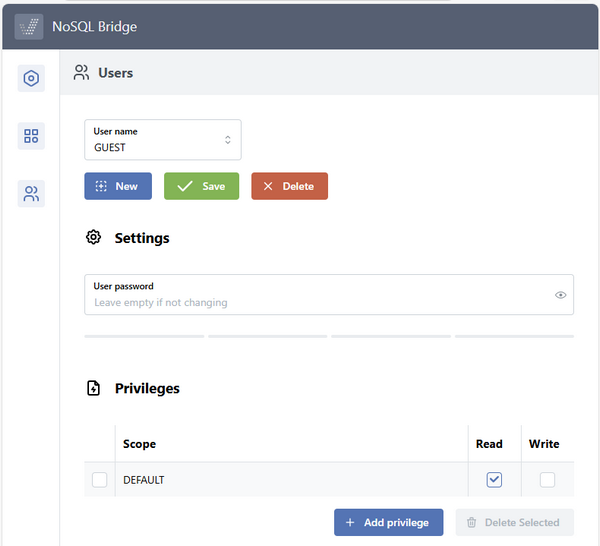

### Configuring Users

The Users page allows you to edit existing users and create new ones.

Each user can be assigned specific permissions for each catalog.

To add a new user, click on the New button and provide the user name.

To edit an existing user, just click in the User name field and select the desired user from the pop-up.

Once a user is selected you can:

- delete it, by click on the *Delete* button,
- assign a password, by filling the *User password* field,
- add or remove permissions, by clicking the *Add privilege* button.

To add a permission:

1. Click the *Add privilege* button
2. Provide the name of the catalog
3. Provide the desired permissions by enabling Read, Write or both

To remove a permission:

1. Select the permission row by clicking on the check-box before the Scope column
2. Click the *Delete Selected* button

While there are unsaved changes, the *Save* button is enabled.

Click *Save* to apply your changes. After the modifications are saved, the button will be disabled.
