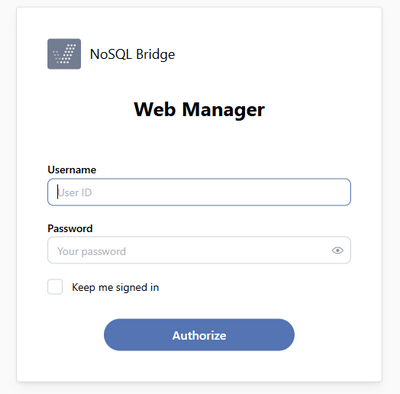

## NoSQL Bridge Administration

As you browse to the NoSQL Bridge webapp URL, a login panel is shown.

Log in as "admin" with password "admin". You will be able to change the password after the first login.

The NoSQL Bridge Web Manager allows you to change the admin user password, configure additional users and configure catalogs. [Configuring Catalogs](./Configuring-Catalogs) is required in order to access data through NoSQL Bridge Functions. Because it is the most important configuration, The Web Manager automatically opens this section after you log in.

All configurations made in the Web Manager are saved in a hidden folder, whose location depends on the context:

| Context | Location |
| --- | --- |
| NoSQL Bridge was started using the nosqlc command and is running as a foreground process | ".nsb" directory under the user home directory |
| NoSQL Bridge was started using the nosql command and is running as Windows service | C:\Windows\ServiceProfiles\LocalService\.nsb |
| NoSQL Bridge was deployed in a servlet container (i.e. Tomcat) that is running as a foreground process | ".nsb" directory under the user home directory |
| NoSQL Bridge was deployed in a servlet container (i.e. Tomcat) that is running as a Windows service | C:\Windows\ServiceProfiles\LocalService\.nsb |
