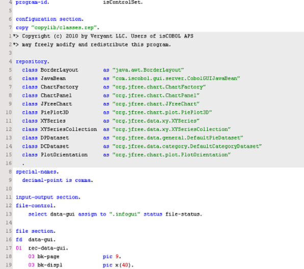
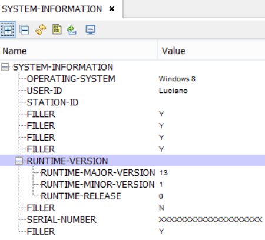
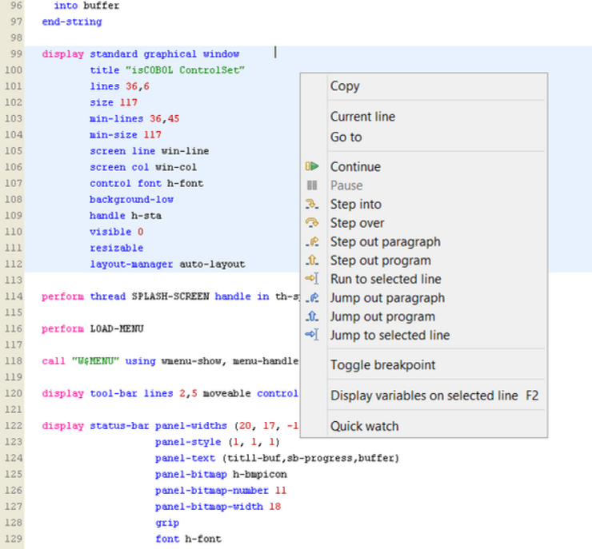
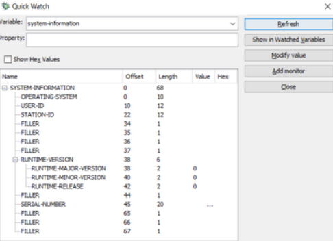
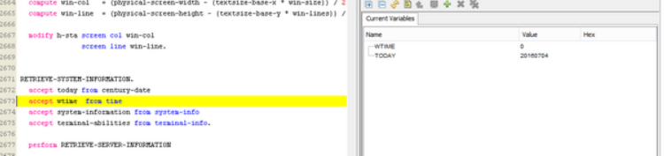
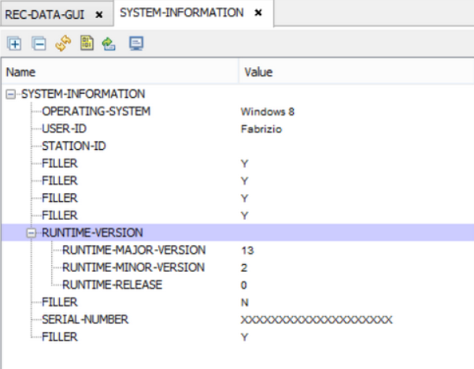
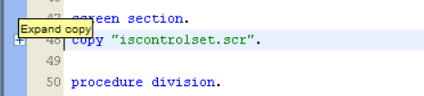
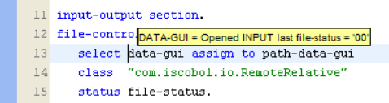
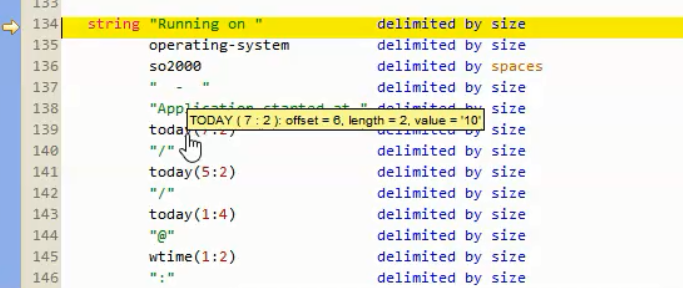

## Debugger

- The isCOBOL Debugger shows the source code using different colors for keywords, strings and literals.

- The isCOBOL Debugger shows the content of copybooks with a different background color, to easily distinguish them from the rest of the source code. When the COPY statement contains the REPLACING clause, the isCOBOL Debugger shows the result of the REPLACING instead of the file content.

- The isCOBOL Debugger allows you to set and inquire graphical controls properties as well as DATA DIVISION variables.

- The isCOBOL Debugger can display group variables as a tree, to easily monitor the content of each item of the group.

- The isCOBOL Debugger allows you to select one or more lines of source code and copy them into the clipboard.

- A quick watch feature is provided to easily handle DATA DIVISION variables and control properties.

- A current variables area is constantly updated as you step through statements, so you can monitor the value of the variables involved in the debugged statements:

- A variable area that allows to monitor multiple data items at once:

- The ability to continue execution until the next called program (see [prog]()).
- The ability to jump to a given line skipping the statements in the middle (see [jump]()).
- The ability to expand and collapse copy files:

- The ability to check files state during the debug session:

- Moving the mouse pointer over a data item in Procedure Division a tool tip with the data item characteristics and value is shown and the mouse pointer becomes an hand; if you left click while the mouse pointer is an hand, the Debugger jumps to the data item definition:

- The isCOBOL Debugger can debug programs on the local pc as well as programs on remote machines.
For detailed information about the above features, consult the [Debugger]() section in User’s Guide.
