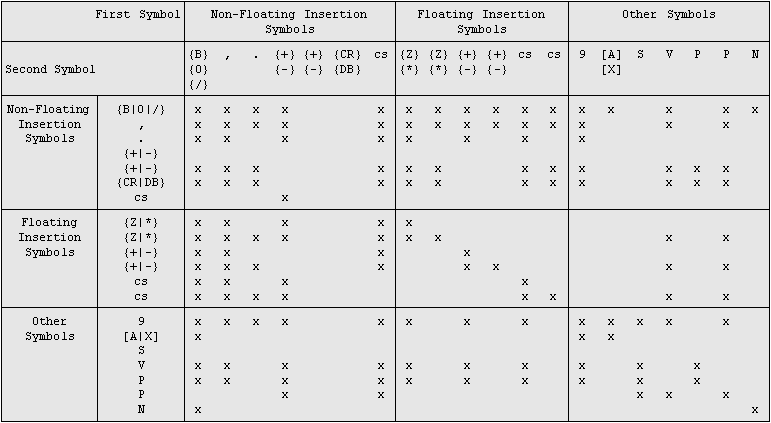

### PICTURE clause

The PICTURE clause describes the general characteristics and editing requirements of an elementary item.

#### Format 1

```cobol
{ PICTURE } IS Character-String 
{ PIC     }
```

#### Format 2

```cobol
{ PICTURE } IS { X } ANY LENGTH 
{ PIC     }    { N }
               { G }
```

#### Format 3

```cobol
{ PICTURE } IS Character-String VARYING
{ PIC     }
```

#### Syntax rules

1. The PICTURE clause can be specified only at the elementary item level.
2. *Character-String* consists of certain allowable combinations of characters in the COBOL character set used as symbols. The allowable combinations determine the category of the elementary item.
3. The lowercase letters corresponding to the uppercase letters representing the PICTURE symbols A, B, G, N, P, S, V, X, Z, CR, and DB are equivalent to their uppercase representations in a PICTURE character string. All other lowercase letters are not equivalent to their corresponding uppercase representations.
4. The PICTURE clause must be specified for every [elementary item](../Concept-of-Levels/Concept-of-Levels), except those specifying *Usage-String-2*.
5. The words PICTURE and PIC are equivalent.
6. The asterisk when used as the zero suppression symbol and the clause BLANK WHEN ZERO may not appear in the same entry
7. Format 3 Character-String can contain only X symbols.

#### General rules

##### Format 1

1. Categories of data that can be described with a PICTURE clause are: alphabetic, numeric, alphanumeric, national, alphanumeric edited, numeric edited and national edited.
2. To define an item as alphabetic:

a. Its PICTURE character-string can contain only the symbol 'A'; and

b. Its content, when represented in standard data format, must be one or more alphabetic characters

3. To define an item as numeric:

a. Its PICTURE character-string can contain only the symbols '9', 'P', 'S', and 'V'. The number of digit positions that can be described by the PICTURE character-string must range from 1 to 31 inclusive; and

b. If unsigned, its content when represented in standard data format must be one or more numeric characters; if signed, the item may also contain a '+ ', '-', or other representation of an operational sign. See the [SIGN clause](./SIGN-clause) for further details.

4. To define an item as alphanumeric:

a. Its PICTURE character-string is restricted to certain combinations of the symbols 'A', 'G', 'X', '9', and the item is treated as if the character-string contained all 'X's. A PICTURE character-string which contains all 'A's or all '9's does not define an alphanumeric item, and;

b. Its content when represented in standard data format must be one or more characters in the computer's character set.

5. To define an item as national:

a. Its PICTURE character-string can contain one or more occurrences of the symbol 'N'.

6. To define an item as alphanumeric edited:

a. Its PICTURE character-string is restricted to certain combinations of the following symbols: 'A', 'G', 'X', '9', 'B', '0', and '/'; and must contain at least one 'A', 'G' or 'X' and must contain at least one 'B' or '0' (zero) or '/' (slant).

b. Its content when represented in standard data format must be two or more characters in the computer's character set.

7. To define an item as numeric edited:

a. Its PICTURE character-string is restricted to certain combinations of the symbols 'B', '/', 'P', 'V, 'Z' '0', '9', ',', '.', '\*', ' + ', '-', 'CR', 'DB', and the currency symbol. The allowable combinations are determined from the order of precedence of symbols and the editing rules; and

i. The number of digit positions that can be represented in the PICTURE character-string must range from 1 to 36 inclusive; and

ii. The character-string must contain at least one '0', 'B', '/', 'Z', '\*', '+', ',', '.', '-', 'CR', 'DB', or the currency symbol.

b. The content of each of the character positions must be consistent with the corresponding PICTURE symbol.

8. To define an item as national edited:

a. Its PICTURE character-string must contain at least one symbol 'N'; and

b. At least one '0', 'B' or '/' (slant) symbol.

9. To define a boolean:

a. Its PICTURE character-string must contain at least one symbol '1'.

10. The size of an elementary item, where size means the number of character positions occupied by the elementary item in standard data format, is determined by the number of allowable symbols that represent character positions. An unsigned nonzero integer which is enclosed in parentheses following the symbols 'A', 'G', ',', 'X', '9', 'P' 'Z', '\*', 'B', '/', '0', '+', '-', 'S', 'V', or the currency symbol indicates the number of consecutive occurrences of the symbol. Note that the following symbols may appear only once in a given PICTURE: 'S', 'V, '.', 'CR', and 'DB'.

11. The functions of the symbols used to describe an elementary item are explain as follows:

- **1** - Each '1' in the character-string represents the position of a boolean character.
- **A** - Each 'A' in the character-string represents a character position which can contain only an alphabetic character and is counted in the size of the item.
- **B** - Each 'B' in the character-string represents a character position into which the space character will be inserted and is counted in the size of the item.
- **G** - Each "G" represents a character position which can contain only a double-byte character set (DBCS) -haracter or a DBCS space. Each symbol 'G' is counted in the size of the item.
- **N** - Each symbol 'N' represents a national character position that shall contain a character from the computer's national character set. Each symbol 'N' is counted in the size of the item.
- **P** - Each 'P' in the character-string indicates an assumed decimal scaling position and is used to specify the location of an assumed decimal point when the point is not within the number that appears in the data item. The scaling position character 'P' is not counted in the size of the data item. Scaling position characters are counted in determining the maximum number of digit positions (36) in numeric edited items or numeric items. The scaling position character 'P' can appear only as a continuous string of 'P's in the leftmost or rightmost digit positions within a PICTURE character-string; since the scaling position character 'P' implies an assumed decimal point (to the left of 'P's if 'P's are leftmost PICTURE symbols and to the right if 'P's are rightmost PICTURE symbols), the assumed decimal point symbol 'V' is redundant as either the leftmost or rightmost character within such a PICTURE description. The symbol 'P' and the insertion symbol '.' (period) cannot both occur in the same PICTURE character-string.

In certain operations that reference a data item whose PICTURE character-string contains the symbol 'P', the algebraic value of the data item is used rather than the actual character representation of the data item. This algebraic value assumes the decimal point in the prescribed location and zero in place of the digit position specified by the symbol 'P'. The size of the value is the number of digit positions represented by the PICTURE character-string. These operations are any of the following:

i. Any operation requiring a numeric sending operand.

ii. A [MOVE](../../Procedure-Division-Statements/MOVE) Statement where the sending operand is numeric and its PICTURE character-string contains the symbol 'P'.

iii. A [MOVE](../../Procedure-Division-Statements/MOVE) Statement where the sending operand is numeric edited and its PICTURE character-string contains the symbol 'P' and the receiving operand is numeric or numeric edited.

iv. A comparison operation where both operands are numeric.

In all other operations the digit positions specified with the symbol 'P' are ignored and are not counted in the size of the operand.

- **S** - The 'S' is used in a character-string to indicate the presence, but neither the representation nor, necessarily, the position of an operational sign; it must be written as the leftmost character in the PICTURE. The 'S' is not counted in determining the size (in terms of standard data format characters) of the elementary item unless the entry is subject to a [SIGN clause](./SIGN-clause) which specifies the optional SEPARATE CHARACTER phrase.
- **V** - The 'V' is used in a character-string to indicate the location of the assumed decimal point and may only appear once in a character-string. The 'V' does not represent a character position and therefore is not counted in the size of the elementary item. When the assumed decimal point is to the right of the rightmost symbol in the string representing a digit position or scaling position, the 'V’ is redundant.
- **X** - Each 'X' in the character-string is used to represent a character position which contains any allowable character from the computer's character set and is counted in the size of the item.
- **Z** - Each 'Z' in a character-string may only be used to represent the leftmost leading numeric character positions which will be replaced by a space character when the content of that character position is a leading zero. Each 'Z' is counted in the size of the item.
- **9** - Each '9' in the character-string represents a digit position which contains a numeric character and is counted in the size of the item.
- **0** - Each '0' (zero) in the character-string represents a character position into which the character zero will be inserted. The '0' is counted in the size of the item.
- / - Each '/' (slant) in the character-string represents a character position into which the slant character will be inserted. The '/' is counted in the size of the item.
- , - Each ',' (comma) in the character-string represents a character position into which the character ',' will be inserted. This character position is counted in the size of the item.
- . - When the symbol '.' (period) appears in the character-string it is an editing symbol which represents the decimal point for alignment purposes and, in addition, represents a character position into which the character '.' will be inserted. The character '.' is counted in the size of the item. For a given program the functions of the period and comma are exchanged if the clause DECIMAL-POINT IS COMMA is stated in the SPECIAL-NAMES paragraph. In this exchange the rules for the period apply to the comma and the rules for the comma apply to the period wherever they appear in a PICTURE clause.
- \+ - **CR DB** - These symbols are used as editing sign control symbols. When used, they represent the character position into which the editing sign control symbol will be placed. The symbols are mutually exclusive in any one character-string and each character used in the symbol is counted in determining the size of the data item.
- \* - Each '\*' (asterisk) in the character-string represents a leading numeric character position into which an asterisk will be placed when the content of that position is a leading zero. Each '\*' is counted in the size of the item.
- **cs** - The currency symbol in the character-string represents a character position into which a currency symbol is to be placed. The currency symbol in a character-string is represented by either the currency sign or by the single character specified in the CURRENCY SIGN clause in the SPECIAL-NAMES paragraph. The currency symbol is counted in the size of the item.

12. The PICTURE clause may be omitted for an elementary item when an alphanumeric or national literal is specified in the [VALUE clause](./VALUE-clause). A PICTURE clause is implied as follows:

- if the literal is national, 'PICTURE N(*length*)'.
- if the literal is alphanumeric, 'PICTURE X(*length*)' where *length* is the length of the literal.

#### Editing rules

1. There are two general methods of performing editing in the PICTURE clause, either by insertion or by suppression and replacement. There are four types of insertion editing available.They are:

a. Simple insertion

b. Special insertion

c. Fixed insertion

d. Floating insertion

There are two types of suppression and replacement editing:

a. Zero suppression and replacement with spaces

b. Zero suppression and replacement with asterisks

2. The type of editing which may be performed upon an item is dependent upon the category to which the item belongs. The following table specifies which type of editing may be performed upon a given category:

| Category | Type of Editing |
| --- | --- |
| Alphabetic | None |
| Numeric | None |
| Alphanumeric | None |
| National | None |
| Alphanumeric edited | Simple insertion '0', 'B1, and '/ |
| Numeric edited | All, subject to rules in rule 3 below |
| National edited | Simple insertion |

3. Floating insertion editing and editing by zero suppression and replacement are mutually exclusive in a PICTURE clause. Only one type of replacement may be used with zero suppression in a PICTURE clause.
4. Simple insertion editing. The ',' (comma), 'B' (space), '0' (zero), and '/' (slant) are used as the insertion characters. The insertion characters are counted in the size of the item and represent the position in the item into which the character will be inserted. If the insertion character ',' (comma) is the last symbol in the PICTURE Character-String, the PICTURE clause must be the last clause of the data description entry and must be immediately followed by the separator period. This results in the combination of ',.' appearing in the data description entry, or, if the DECIMAL POINT IS COMMA clause is used, in two consecutive periods.
5. Special insertion editing. The '.' (period) is used as the insertion character. In addition to being an insertion character it also represents the decimal point for alignment purposes. The insertion character used for the actual decimal point is counted in the size of the item.The use of the assumed decimal point, represented by the symbol 'V' and the actual decimal point, represented by the insertion character, in the same PICTURE character-string is disallowed. If the insertion character is the last symbol in the PICTURE character-string, the PICTURE clause must be the last clause of that data description entry and must be immediately followed by the separator period. This results in two consecutive periods appearing in the data description entry, or in the combination of ',." if the DECIMAL-POINT IS COMMA clause is used. The result of special insertion editing is the appearance of the insertion character in the item in the same position as shown in the character-string.
6. Fixed insertion editing. The currency symbol and the editing sign control symbols '+', '-', 'CR', 'DB' are the insertion characters. Only one currency symbol and only one of the editing sign control symbols can be used in a given PICTURE character-string. When the symbols 'CR' or 'DB' are used they represent two character positions in determining the size of the item and they must represent the rightmost character positions that are counted in the size of the item. If these character positions contain the symbols 'CR' or 'DB', the uppercase letters are the insertion characters. The symbol '+' or '-', when used, must be either the leftmost or rightmost character position to be counted in the size of the item. The currency symbol must be the leftmost character position to be counted in the size of the item except that it can be preceded by either a '+' or a '-' symbol. Fixed insertion editing results in the insertion character occupying the same character position in the edited item as it occupied in the PICTURE character-string. Editing sign control symbols produce the following results depending upon the value of the data item:

| Editing symbol in picture Character-String | Result Data item in positive or zero | Data item negative |
| --- | --- | --- |
| + | + | - |
| - | Space | - |
| CR | 2 Spaces | CR |
| DB | 2 Spaces | DB |

7. Floating insertion editing. The currency symbol and editing sign control symbols '+' and '-' are the floating insertion characters and as such are mutually exclusive in a given PICTURE character-string.

Floating insertion editing is indicated in a PICTURE character-string by using a string of at least two of the floating insertion characters. This string of floating insertion characters may contain any of the simple insertion characters or have simple insertion characters immediately to the right of this string. These simple insertion characters are part of the floating string. When the floating insertion character is the currency symbol, this string of floating insertion characters may have the fixed insertion characters 'CR' and 'DB' immediately to the right of this string.

The leftmost character of the floating insertion string represents the leftmost limit of the floating symbols in the data item. The rightmost character of the floating string represents the rightmost limit of the floating symbols in the data item.

The second floating character from the left represents the leftmost limit of the numeric data that can be stored in the data item. Nonzero numeric data may replace all the characters at or to the right of this limit.

In a PICTURE character-string, there are only two ways of representing floating insertion editing. One way is to represent any or all of the leading numeric character positions on the left of the decimal point by the insertion character. The other way is to represent all of the numeric character positions in the PICTURE character-string by the insertion character.

If the insertion character positions are only to the left of the decimal point in the PICTURE character-string, the result is that a single floating insertion character will be placed into the character position immediately preceding either the decimal point or the first nonzero digit in the data represented by the insertion symbol string, whichever is farther to the left in the PICTURE character-string. The character positions preceding the insertion character are replaced with spaces.

If all numeric character positions in the PICTURE character-string are represented by the insertion character, at least one of the insertion characters must be to the left of the decimal point.

When the floating insertion character is the editing control symbol '+' or '-', the character inserted depends upon the value of the data item:

| Editing symbol in picture Character-String | Result Data item in positive or zero | Data item negative |
| --- | --- | --- |
| + | + | - |
| - | Space | - |

If all numeric character positions in the PICTURE character-string are represented by the insertion character, the result depends upon the value of the data. If the value is zero the entire data item will contain spaces. If the value is not zero, the result is the same as when the insertion character is only to the left of the decimal point.

To avoid truncation, the minimum size of the PICTURE character-string for the receiving data item must be the number of characters in the sending data item, plus the number of nonfloating insertion characters being edited into the receiving data item, plus one for the floating insertion character. If truncation does occur, the value of the data that is used for editing is the value after truncation. See [Standard Alignment Rules](../Standard-Alignment-Rules").

8. Zero suppression editing. The suppression of leading zeros in numeric character positions is indicated by the use of the alphabetic character 'Z' or the character '\*' (asterisk) as suppression symbols in a PICTURE character-string. These symbols are mutually exclusive in a given PICTURE character-string. Each suppression symbol is counted in determining the size of the item. If 'Z' is used the replacement character will be the space and if the asterisk is used, the replacement character will be '\*'.

Zero suppression and replacement is indicated in a PICTURE character-string by using a string of one or more of the allowable symbols to represent leading numeric character positions which are to be replaced when the associated character position in the data contains a leading zero. Any of the simple insertion characters embedded in the string of symbols or to the immediate right of this string are part of the string.

In a PICTURE character-string, there are only two ways of representing zero suppression. One way is to represent any or all of the leading numeric character positions to the left of the decimal point by suppression symbols. The other way is to represent all of the numeric character positions in the PICTURE character-string by suppression symbols.

If the suppression symbols appear only to the left of the decimal point, any leading zero in the data which corresponds to a symbol in the string is replaced by the replacement character. Suppression terminates at the first nonzero digit in the data represented by the suppression symbol string or at the decimal point, whichever is encountered first.

If all numeric character positions in the PICTURE character-string are represented by suppression symbols and the value of the data is not zero the result is the same as if the suppression characters were only to the left of the decimal point. If the value is zero and the suppression symbol is 'Z', the entire data item, including any editing characters, is spaces. If the value is zero and the suppression symbol is '\*', the entire data item, including any insertion editing symbols except the actual decimal point, will be '\*'. In this case, the actual decimal point will appear in the data item.

9. The symbols '+', '-', '\*', 'Z', and the currency symbol, when used as floating replacement characters, are mutually exclusive within a given character-string.

#### Precedence rules

The chart below shows the order of precedence when using characters as symbols in a character-string. An 'X' at an intersection indicates that the symbol(s) at the top of the column may precede (but not necessarily immediately), in a given character-string, the symbol(s) at the left of the row. Arguments appearing in braces { } indicate that the symbols are mutually exclusive.The currency symbol is indicated by the symbol 'cs'.

At least one of the symbols '1', 'A', 'G', 'N', 'X', 'Z', '9', or '\*' or at least two occurrences of one of the symbols '+', '-', or 'cs' must be present in a PICTURE character-string.

Nonfloating insertion symbols '+' and '-', floating insertion symbols 'Z', ' \*', '+', '-', and 'cs', and other symbol 'P' appear twice in the PICTURE character precedence chart below. The leftmost column and uppermost row for each symbol represents its use to the left of the decimal point position. The second appearance of the symbol in the chart represents its use to the right of the decimal point position.



#### Boolean characters

1. PIC 1 may be used with USAGE DISPLAY, COMP, COMP-5, COMP-X, BIT.
2. When used with USAGE COMP, COMP-5, COMP-X the minimum number of bytes needed to store the required number of bits is allocated.
3. When used with USAGE DISPLAY, one byte per bit is allocated.
4. Each byte contains '0' or '1'.
5. When using USAGE BIT, the exact numbers of bits are used that are allocated in the current bit field. For example, the following declaration allocates 3 bytes:

```cobol
01 BOOL-ITEM PIC 1(24) USAGE COMP-5.
```

6. The maximum number of bits allowed is 64.
7. Displaying a PIC 1 field will display the bit values as a sequence of '0' and '1' symbols, i.e. '000101'.
8. PIC 1 fields are numeric and may be used in computations and MOVEs for their integer value.
9. Data items described as PIC 1 USAGE BIT are allowed to have an OCCURS clause. For example:

```cobol
01 BOOL-ITEMS PIC 1 USAGE BIT OCCURS 1000.
```

#### External Floating Point

1. An external floating point item is a character string which has the following format:
  - mantissa sign
    - \+ or - (mandatory)
  - mantissa
    - A numeric value between 1 and 16 digits in length that may in addition contain either a period (.) to denote an explicit decimal point, or a V to denote an implicit decimal point. The decimal point symbol may appear in any position of the mantissa.
  - E
    - A constant that introduces the exponent.
  - exponent sign
    - \+ or - (mandatory)
  - exponent
    - A two- or three-digit numeric value.

```cobol
{+} mantissa E {+} exponent
{-}            {-}
```

2. A sign character must immediately precede both the mantissa and the exponent.
3. A "+" sign indicates that a positive sign will be used in the output to represent positive values and that a negative sign will represent negative values.
4. A "-" sign indicates that a blank will be used in the output to represent positive values and that a negative sign will represent negative values.
5. Each sign position occupies one byte of storage.
6. The mantissa can contain the symbols 9, . and V.
7. An actual decimal point can be represented with a period while an assumed decimal point is represented by a V. Either an actual or an assumed decimal point must be present in the mantissa; the decimal point can be leading, embedded or trailing. The mantissa can contain from 1 to 16 numeric characters.
8. E indicates the exponent.
9. The exponent must be a PIC "99".
10. The OCCURS, REDEFINES and RENAMES clauses can be associated with external floating-point items.
11. The SIGN clause is documentary only and has no effect on the representation of the sign.
12. The SYNCHRONIZED clause is documentary only.
13. The BLANK WHEN ZERO, JUSTIFIED and VALUE clauses are invalid with external floating-point items.

#### Example

```cobol
PIC +9(2).9(2)E+99
```

#### Format 2

1. ANY LENGTH items are always alphanumeric.
2. ANY LENGTH items are zero bytes in size when they’re initialized.
3. The size of an ANY LENGTH length item’s size corresponds to the size of the value that is stored in it.
4. When referenced over their size, ANY LENGTH items are automatically resized to make the referenced area exist.
5. When ANY LENGTH items are included in group items, they don't alter neither the group item size nor the offset the other sub-items. COBOL statements that use the group item as a buffer of bytes without caring about the item structure will not consider the ANY LENGTH items inside. It is good practice to use ANY LENGTH items as elementary items.
6. When an ANY LENGTH item is used in the Linkage Section, that item can receive any alphanumeric parameter: a constant string, a fixed length alphanumeric item or another item with picture ANY LENGTH.
7. If a caller program passes an ANY LENGTH item and the callee receives it in a fixed length alphanumeric item, the callee may not try to access the parameter over the boundaries dictated by the current size of the ANY LENGTH item, otherwise an IndexOutOfBounds error occurs.
8. Setting an ANY LENGTH item to the figurative constant SPACE initializes the data item making it zero bytes in size. This rule applies to MOVE and SET statements as well as the VALUE clause. Moving space characters to an ANY LENGTH item instead resizes the item to host those space characters. The below code snippet summarizes this rule:

```cobol
      working-storage section.
       77 wrk-item pic x any length value space.
        
       procedure division.
       main-logic.
      *At program start, wrk-item is 0 bytes in size and hosts no data  
           move "   " to wrk-item.
      *after the above MOVE, wrk-item is 3 bytes in size and hosts 3 spaces
           move space to wrk-item.
      *after the above MOVE, wrk-item is 0 bytes in size and hosts no data
```

9. Setting an ANY LENGTH item to the figurative constants ZERO, LOW-VALUE, HIGH-VALUE, ALL literal or ALL *symbolic character* causes all the characters in the item to be replaced with zeros, low values, high values, literals or symbolic characters respectively. It the ANY LENGTH item is zero bytes in size, the setting has no effect.
10. The proper way to resize ANY LENGTH items to a specific size is by using a format 2 INITIALIZE statement.

#### Format 3

1. VARYING items are used in ESQL programs to handle VARCHAR fields. The item is internally translated into:  
Where n is the number of digits specified in Character-String. The first field contains the text of the VARCHAR field, the second fields contains the length of the value for the VARCHAR field.

```cobol
01  Data-Name-1.
    03  Data-Name-1-arr pic X(n).
    03  Data-Name-1-len pic S9(4) COMP-5.
```

2. VARYING items shouldn’t be used to intercept NULL values. The length parameter is set to unpredictable values in this case.

For more information see [Mapping a VARCHAR field to a COBOL group data item](../../Embedded-SQL-Statements/Mapping-a-VARCHAR-field-to-a-COBOL-group-data-item).
