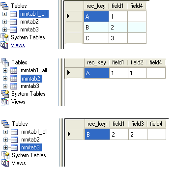

## ALWAYS Directive

The [WHEN Directive](./WHEN-Directive) distributes fields into separate tables depending on conditions known as "WHEN conditions". When a file description contains WHEN Directives, some records may be skipped because they don't meet any WHEN conditions. The ALWAYS directive makes all records available in a named table regardless of whether they meet WHEN conditions. This directive should be specified at the record level.

This directive only affects iss dictionaries and therefore it can be used only along with the -efc compiler option.

```cobol
>>EFD ALWAYS
```

or

```cobol
$EFD ALWAYS
```

or

```cobol
*(( EFD ALWAYS ))
```

or

```cobol
*>(( EFD ALWAYS ))
```

### Example

The following FD:

```cobol
       FD tab1.
      >>EFD ALWAYS TABLENAME=MMTAB1_ALL
       01 rec.
           02 rec-KEY pic x(12).
           02 field1  pic x.
      >>EFD WHEN FIELD1 = 1 TABLENAME=MMTAB2
           02 field2  pic x.
      >>EFD WHEN FIELD1 = 2 TABLENAME=MMTAB3
           02 field3  pic x.
           02 field4  pic x.
```

Generates the following tables on c-tree SQL.



The record with FIELD1=3 would be lost because it doesn’t match any of the $EFD WHEN directives, but thanks to the $EFD ALWAYS directive, it can be stored in a table where all the records are shown, regardless of the value of FIELD1.
