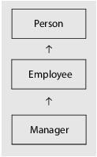
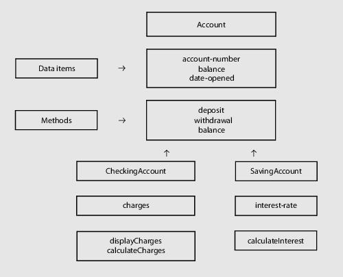

### Inheritance

One of the language features that separates object oriented languages from conventional programming languages is the ability to develop a hierarchy of classes, as shown by the example below.



The manager class is a subclass of the employee class which in turn is a subclass of the person class. Or said another way, the employee class is the superclass of the manager class and the person class is the superclass of the employee class. At any point in the hierarchy, the classes above a given class are its superclasses or its ancestors and the classes below are its subclasses or its children. A subclass includes all of the capabilities of all of its ancestors and additionally may add to or override these capabilities. For example, the methods of the person and employee classes are available to an instance of the manager class as well as the methods defined for the manager class.

Inheritance is the mechanism used to develop class hierarchies.

Inheritance supports a hierarchy of classes, where every instance of a subclass can be used "as if it were" an instance of its superclasses. For example, a manager object could be used as if it were an employee object, and an employee object could be used as if it were a person object. This is the principle of conformance between classes. When classes conform, a data item declared as a reference to an object of a given class may in fact reference an object of any class that descends from that given class.

Inheritance represents an "is a" relationship between two classes and is a way of specializing a higher level class. In the figure above, Manager class, a manager "is an" employee and an employee "is a" person. All the object data definitions described in the superclasses, person and employee, plus the object data definitions for the class itself, manager, are used to create an instance of the manager class. Also, the methods defined by the superclasses are inherited by the subclass and are used to directly operate on any instance of manager.

Both factory and instance data and methods of all ancestor classes are inherited by a class that inherits from another class.

When inheritance is used to define a subclass, data in the superclass is encapsulated because methods defined for the subclass are not allowed to directly access the data items defined for the superclasses. It requires all subclasses to use methods defined for the superclasses to access the data items defined for the superclasses. As an example, if the employee class defined the data item "employee-name", the employee class would have to include a method, say getName, to allow any subclass to retrieve the employee name.

A class may inherit from more than one other class, this is called multiple inheritance.

#### Example of single inheritance:

A bank will have different kinds of accounts, and yet they are all accounts. If we consider checking accounts and savings accounts, they have a number of common features, they both have an owner and a balance. They also have some different features, the fact that checks are allowed for one and the other pays interest. It makes sense to have a basic account class that contains the common parts and then to use inheritance to define the checking account and the savings account subclasses. Thus the account class defines what is common to all accounts; the checking account class defines what is specific to checking accounts; and the savings account class defines only what is specific to savings accounts. Any changes to the account class will be picked up by the inheriting classes automatically.

These relationships can be represented as shown in the figure below.



In the example shown, each instance of CheckingAccount is automatically created with memory allocated for the attributes account-number, balance, date-opened and charges. Additionally, the methods deposit, withdraw, and balance inherited from Account and the methods displayCharges and calculateCharges defined in the CheckingAccount class can act on each instance. Each instance of SavingsAccount is automatically created with memory allocated for the attributes account-number, balance, date-opened and interest-rate. Each instance of SavingsAccount can access the methods deposit, withdraw and balance inherited from Account and the method calculateInterest defined for itself.

Some sample code for the account and checking account classes is shown below:

##### Account Class

```cobol
    CLASS-ID. Account INHERITS Base.
    ENVIRONMENT DIVISION.
    CONFIGURATION SECTION.
    REPOSITORY
       CLASS Base.
    FACTORY.
    DATA DIVISION.
    WORKING-STORAGE SECTION.
    01  number-of-accounts      PIC 9(5).
    PROCEDURE DIVISION.
    METHOD-ID. newAccount.
       method code
    END METHOD.
    ...
    END FACTORY.
    OBJECT.
    DATA DIVISION.
    WORKING-STORAGE SECTION.
    01  ACCOUNT-INFORMATION.
        03 account-number       PIC X(12).
        03 balance              PIC S9(8)V99.
        03 date-opened          PIC 9(8).
    ...
    PROCEDURE DIVISION.
    METHOD-ID. deposit.
    ...
    END METHOD.
    METHOD-ID. withdraw.
    ...
    END METHOD.
    METHOD-ID. balance.
    ...
    END METHOD.
    ...
```

##### CheckingAccount Class

```cobol
Example of single inheritance:
A bank will have different kinds of accounts, and yet they are all accounts. If we consider checking accounts and savings accounts, they have a number of common features, they both have an owner and a balance. They also have some different features, the fact that checks are allowed for one and the other pays interest. It makes sense to have a basic account class that contains the common parts and then to use inheritance to define the checking account and the savings account subclasses. Thus the account class defines what is common to all accounts; the checking account class defines what is specific to checking accounts; and the savings account class defines only what is specific to savings accounts. Any changes to the account class will be picked up by the inheriting classes automatically.
These relationships can be represented as shown in the figure below.

 
In the example shown, each instance of CheckingAccount is automatically created with memory allocated for the attributes account-number, balance, date-opened and charges. Additionally, the methods deposit, withdraw, and balance inherited from Account and the methods displayCharges and calculateCharges defined in the CheckingAccount class can act on each instance. Each instance of SavingsAccount is automatically created with memory allocated for the attributes account-number, balance, date-opened and interest-rate. Each instance of SavingsAccount can access the methods deposit, withdraw and balance inherited from Account and the method calculateInterest defined for itself.
 
Some sample code for the account and checking account classes is shown below:
Account Class
    CLASS-ID. Account INHERITS Base.
    ENVIRONMENT DIVISION.
    CONFIGURATION SECTION.
    REPOSITORY
       CLASS Base.
    FACTORY.
    DATA DIVISION.
    WORKING-STORAGE SECTION.
    01  number-of-accounts      PIC 9(5).
    PROCEDURE DIVISION.
    METHOD-ID. newAccount.
       method code
    END METHOD.
    ...
    END FACTORY.
    OBJECT.
    DATA DIVISION.
    WORKING-STORAGE SECTION.
    01  ACCOUNT-INFORMATION.
        03 account-number       PIC X(12).
        03 balance              PIC S9(8)V99.
        03 date-opened          PIC 9(8).
    ...
    PROCEDURE DIVISION.
    METHOD-ID. deposit.
    ...
    END METHOD.
    METHOD-ID. withdraw.
    ...
    END METHOD.
    METHOD-ID. balance.
    ...
    END METHOD.
    ...
CheckingAccount Class
 
    CLASS-ID. CheckingAccount INHERITS Account.
    ENVIRONMENT DIVISION.
    CONFIGURATION SECTION.
    REPOSITORY.
    CLASS Account.
    ...
    OBJECT.
    DATA DIVISION.
    WORKING-STORAGE SECTION.
    01  checking-account
        03 charges              PIC S9(8)V99.
    ...
    PROCEDURE DIVISION.
    METHOD-ID. displayCharges.
    ...
    END METHOD.
    METHOD-ID. calculateCharges.
    ...
    END METHOD.
    ...
```
