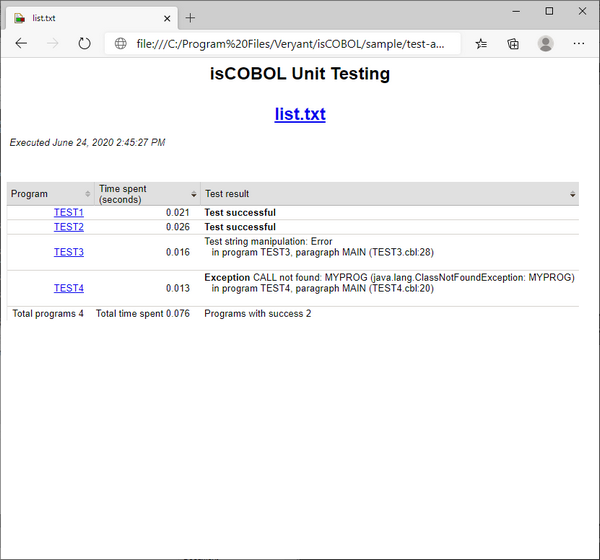

## Using isCOBOL Code Coverage and isCOBOL Unit Test together

isCOBOL Code Coverage and isCOBOL Unit Test can be used together by activating both runtime options on the runtime command line or by invoking the dedicated Run Configuration from the isCOBOL Coverage History in the IDE.

In order to use both features on the command line, use a command like this:

```cobol
iscrun -c iut.cfg -iut -J-ea -coverage
```

When the two features are used together all the HTML reports are stored in the folder specified by [iscobol.coverage.html](../Compiler-and-Runtime/Configuration/Configuration-Properties#iscobol-code-coverage-configuration) and [iscobol.unit_test.html](../Compiler-and-Runtime/Configuration/Configuration-Properties#unit-test-configuration) is ignored.

The file generated by the Unit Test engine becomes the main document and clicking on a program name in that document you can reach the coverage report of that program:



In order to use both features in the IDE, follow the steps described in [Running an Unit Test from the IDE](./isCOBOL-Unit-Test/Running-an-Unit-Test-from-the-IDE) to create the necessary Run Configuration, then

1. click on *Run* in the menu bar,
2. choose *isCOBOL Coverage History*,
3. select the Run Configuration previously created.

The [Coverage](../../../is-cobol-IDE/The-isCOBOL-IDE-Perspective/iscobolIDE-perspective) view and the [isUnit](../../../is-cobol-IDE/The-isCOBOL-IDE-Perspective/iscobolIDE-perspective) view will show the report of the test.
