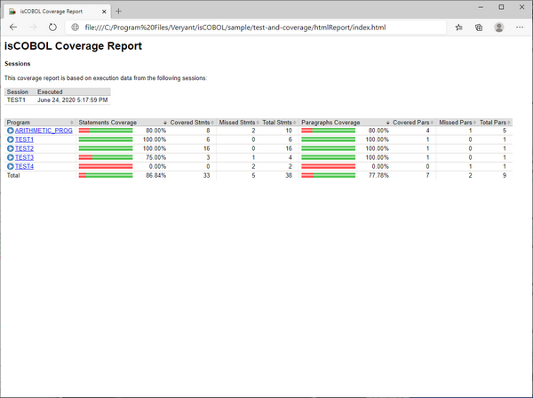
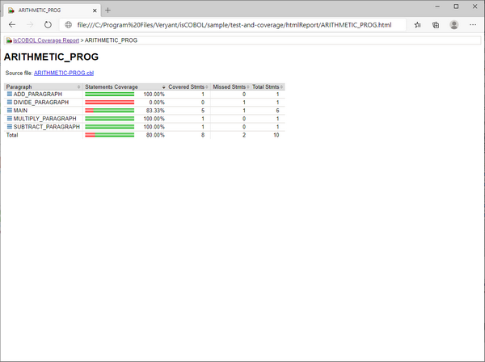
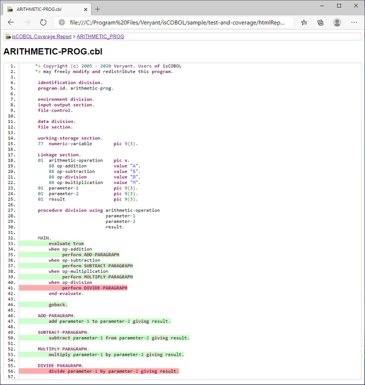
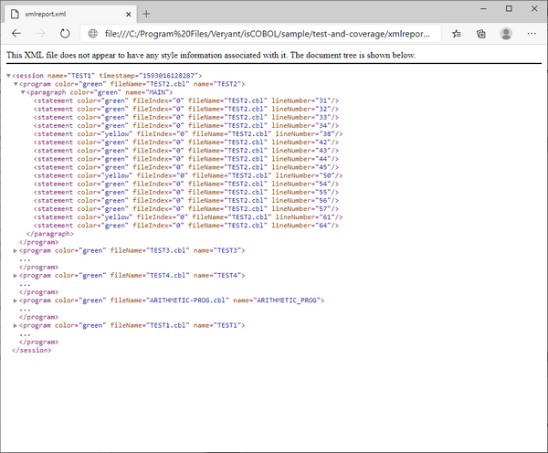

### Running an application with isCOBOL Code Coverage from the command-line

Before running the application with isCOBOL Code Coverage, you should consider configuring the Coverage engine by setting one or more of the properties described in [isCOBOL Code Coverage Configuration](../../Compiler-and-Runtime/Configuration/Configuration-Properties#iscobol-code-coverage-configuration). For example, you can include only some of the programs in the test coverage by setting [iscobol.coverage.analysis.includes](../../Compiler-and-Runtime/Configuration/Configuration-Properties#iscobol-code-coverage-configuration) or to exclude some of the programs by setting [iscobol.coverage.analysis.excludes](../../Compiler-and-Runtime/Configuration/Configuration-Properties#iscobol-code-coverage-configuration).

You may also specify the location of COBOL source files by setting [iscobol.coverage.sourcefiles](../../Compiler-and-Runtime/Configuration/Configuration-Properties#iscobol-code-coverage-configuration), as these files are searched in the current directory by default, but the current directory doesn’t usually match with any of the directories where source files are stored.

You can also create a folder to host the HTML report generated by the Coverage engine, and set [iscobol.coverage.html](../../Compiler-and-Runtime/Configuration/Configuration-Properties#iscobol-code-coverage-configuration) to point to this folder. By default, the Coverage engine looks for a folder named "htmlReport" in the current directory. If the folder doesn’t exist, it is automatically created.

In order to run an application with isCOBOL Code Coverage, add the [-coverage](../../Compiler-and-Runtime/Runtime-Framework/Runtime-Options#-coverage) option to the runtime command line, e.g.

```cobol
iscrun -coverage -c myApp.cfg ProgramName
```

When the runtime session terminates, the folder pointed to by [iscobol.coverage.html](../../Compiler-and-Runtime/Configuration/Configuration-Properties#iscobol-code-coverage-configuration) will include several files. Open "index.html" with your favorite web browser to see the isCOBOL Code Coverage report.

The home page of the report will look like this:

In the home page you see the list of involved COBOL classes. For each class, the following information is provided:

| Column Name | Column Content |
| --- | --- |
| Program | Class name stripped of the ".class" extension. |
| Statements Coverage | Graphical representation of the amount of missed statements (red) and the amount of covered statements (green). |
| Covered Stmts | Count of covered statements. |
| Missed Stmts | Count of missed statements. |
| Total Stmts | Total number of statements. |
| Paragraphs Coverage | Graphical representation of the amount of missed paragraphs (red) and the amount of covered paragraphs (green). |
| Covered Pars | Count of covered paragraphs. |
| Missed Pars | Count of missed paragraphs. |
| Total Pars | Total number of paragraphs. |

Clicking on the COBOL class name in the Program column brings you to a detailed analysis of the class activity:

In this page, the following information is provided:

| Column Name | Column Content |
| --- | --- |
| Paragraph | Name of the paragraph. It is prefixed by the method name if the interested class is a CLASS-ID program. |
| Statements Coverage | Graphical representation of the amount of missed statements (red) and the amount of covered statements (green). |
| Covered Stmts | Count of covered statements. |
| Missed Stmts | Count of missed statements. |
| Total Stmts | Total number of statements. |

Clicking on the source file name above the table brings you to a detailed analysis of the source code, where you can see covered code with a green background and missed code with a red background:

**Note** - The CONTINUE statement is an empty statement with no equivalent in the Java program, and is colored in green only when the program is compiled in debug mode. The following statements are colored in red if they thrown an exception: ACCEPT without EXCEPTION clauses, CLOSE, COMMIT, DELETE, DISPLAY without EXCEPTION clauses, GENERATE, MODIFY without EXCEPTION clauses, OPEN, READ, REWRITE, ROLLBACK, SORT, START, TERMINATE, UNLOCK and WRITE.

It’s also possible to obtain a coverage report in XML format.

Set [iscobol.coverage.xml](../../Compiler-and-Runtime/Configuration/Configuration-Properties#iscobol-code-coverage-configuration) to the name of the XML file that you want to obtain.

The XML file content looks like this:

The main element is *session* and it includes one or more *program* element.

Every *program* element includes one or more *paragraph* elements.

Every *paragraph* element includes one or more *statement* element.

For each element, the *color* attribute specifies if the element was covered ('green') or not ('red'). The value 'yellow' indicates a statement that has multiple branches and that not all the branches in code have been reached (e.g. an IF statement).

If you set only one between [iscobol.coverage.xml](../../Compiler-and-Runtime/Configuration/Configuration-Properties#iscobol-code-coverage-configuration) and [iscobol.coverage.html](../../Compiler-and-Runtime/Configuration/Configuration-Properties#iscobol-code-coverage-configuration), then only the report related to the property that you set is generated.

If you set both properties, then both reports are generated.

If you don't set any of these properties, then an HTML report is generated in the "./htmlReport" directory.

XML reports of multiple runtime sessions can be merged together by setting the [iscobol.coverage.append](../../Compiler-and-Runtime/Configuration/Configuration-Properties#iscobol-code-coverage-configuration) configuration property.

#### The javaagent option

The javaagent option allows you to customize the Code Coverage behavior where the -coverage option is not available, like for example in application server environments or in WEB.

The command

```cobol
iscrun -coverage ProgramName
```

is equivalent to:

```cobol
iscrun -J-javaagent:/path/to/isprofiler.jar=coverage;html=htmlReport ProgramName
```

**Note** - isprofiler.jar is located in the lib folder of the isCOBOL SDK.

The javaagent option allows you to specify some options to customize the Code Coverage behavior and the resulting report. The syntax is:

```cobol
-J-javaagent:/path/to/isprofiler.jar=coverage;[option1=value1;option2=value2;...;optionN=valueN]
```

Where the available options are:

| Option | Value |
| --- | --- |
| append | Pathname of a report file in XML format to be appended to the existing XML report. This option can be specified multiple times. |
| classfiles | List of paths where the Coverage engine can find the class files used to build the report. Multiple paths must be separated by the line feed character or by the current operating system path separator.By default the report is built using the classes loaded by the runtime. |
| excludes | Comma separated list of COBOL classes that must not be included in the analysis.<br>Regular expressions can be used to specify a pattern, for example:<br>excludes=SAMPLE,IO.<br>*will exclude the SAMPLE class and all the COBOL classes whose name starts with "IO".<br>By default, all COBOL classes are analyzed. |
| html | Pathname of a folder that will host a report in HTML format. |
| includes | Comma separated list of COBOL classes that must be included in the analysis.<br>Regular expressions can be used to specify a pattern, for example:<br>includes=SAMPLE,IO.<br>*will include the SAMPLE class and all the COBOL classes whose name starts with "IO".<br>By default, all COBOL classes are analyzed. |
| sessionname | Name of the coverage session. This name appears on top of the index.html file of the HTML report. The default value is the name of the main program as specified on the command-line. |
| sourcefiles | List of paths where the Coverage engine can find the COBOL sources. Multiple paths must be separated by the line feed character or by the current operating system path separator.<br>The default value is "." (the current directory). |
| xml | Pathname of a report file in XML format. |

**Note** - if neither *html* nor *xml* is specified, then no output is generated. You should use only one of these two options, depending on the output type that you prefer.

**Note** - when using the javaagent option, the configuration properties whose prefix is "iscobol.coverage" are ignored; only the above options are considered when using the javaagent option.

#### Using Code Coverage and Profiler together

The isprofiler.jar library implements both the Code Coverage and the Profiler, however it’s not possible to use these two features together.

On the iscrun command line, if you specify both the -coverage option and the -profile option, e.g.

```cobol
iscrun -coverage -profile ProgramName
```

an error is shown and the runtime doesn’t start.

Using the javaagent option as follows:

```cobol
-J-javaagent:/path/to/isprofiler.jar=coverage;[option1=value1;option2=value2;...;optionN=valueN];profiler;[option1=value1;option2=value2;...;optionN=valueN]
```

A warning is shown and only the first feature (coverage, in this case) is activated.

#### The C$COVERAGE library routine

Another way to customize the Code Coverage behavior and the report files is by calling the [C$COVERAGE](\) library routine. The routine is even more powerful than the javaagent option because it allows you to choose when the data gathered by the Code Coverage should be flushed to disc (see [CCOV-FLUSH](\)).
