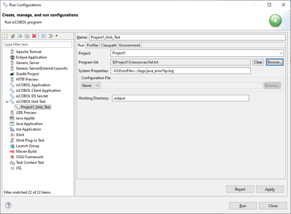

### Running an Unit Test from the IDE

The isCOBOL Unit Test is integrated in the isCOBOL IDE.

In order to create a Unit Test in the IDE, a dedicated Run Configuration must be created.

1. click on *Run* in the menu bar and choose *Run Configurations...*,
2. Right click on *isCOBOL Unit Test* in the list on the left and choose *New Configuration*,
3. Fill the fields as follows:

| Field | Value |
| --- | --- |
| Name | The name that you wish to assign to this Run Configuration. |
| Project | The project where the programs to test are included. Choose it from the list. |
| Program list | Click on the *Browse* button after the field and use the pop-up dialog to select the list of programs to include. You can select the list file either from the current workspace or from the file system. Ensure that the list file includes only main programs, so programs that don’t use Linkage Section items. |

4. Click on the *Apply* button, then on the Run button

The Unit Test will run and the results will be shown in the [isUnit](../../../../is-cobol-IDE/The-isCOBOL-IDE-Perspective/iscobolIDE-perspective) view.

A green panel in the top right corner of this view means that all tests were successful. A red panel instead means that at least one of the tests failed. Clicking on the program name populates the Failure Trace field with the exception stack of the error that caused the failure of the test. Clicking on the hyperlinks in the stack will bring you to the problematic line of code in the COBOL source.

From this moment you can run or debug the test by choosing the Run Configuration name from the *Run History* menu and the *Debug History* menu. It’s also possible to run the Unit Test along with a Coverage test, as explained later in this document.
